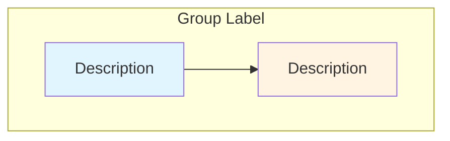

# Skill: Write Spark Blog Post

Write technical blog posts that explain Apache Spark internals for this Jekyll-based blog (Just the Docs theme). Posts are written in Chinese with technical terms (class names, config keys, API names) kept in English.

## Prerequisites

- Spark source code is cloned at `spark/` in the workspace root (currently Spark 4.2.0-SNAPSHOT on `master` branch)
- Always read source code directly from `spark/` when referencing implementations
- Use the latest code from the `spark/` directory; update code snippets and class references to match the current source

## Blog Post Structure

Every blog post must follow this exact structure:

### 1. Frontmatter

```yaml
---
layout: page
title: <Page Title>
nav_order: <number>
parent: <parent section name>
grand_parent: <grandparent section name>  # only for 3-level deep pages
---
```

- `parent` / `grand_parent` must match existing section titles exactly (e.g., `spark`, `sql`, `connect`, `PySpark`)
- Section index pages additionally have `has_children: true` and `permalink: /path/`

### 2. Title and TOC

```markdown
# <Full Descriptive Title in Chinese>
{: .no_toc}

## 目录
{: .no_toc .text-delta}

1. TOC
{:toc}
```

### 3. Optional Subtitle / Version Note

A brief one-liner below the H1 title, e.g.:

```markdown
本文基于 Spark 4.2 学习 <topic>。
```

### 4. Body Sections

Use `##` for major sections and `###` for subsections. Typical section flow:

1. **概述 / 引言** — Introduce the topic, why it matters
2. **示例代码** — A simple, runnable example that demonstrates the feature
3. **核心流程概览** — High-level overview with a mermaid diagram
4. **分步详解** — Deep dive into each step (use `第一部分`, `第二部分`, etc. for large posts)
5. **源码分析** — Key source code snippets with explanations
6. **配置参数** — Relevant Spark configs in a table
7. **总结** — Key takeaways as numbered list
8. **进一步阅读** — Optional links to docs, source code, related posts

### 5. Footer

```markdown
---

*本文基于 Apache Spark X.X.X 源代码分析。*
```

## Content Guidelines

### Focus on High-Level Understanding

The goal is to help readers understand Spark internals at an architectural level. Focus on:

- **What** each component does and **why** it exists
- **How** components interact with each other
- The **data flow** through the system
- **Key design decisions** and trade-offs

### What to Include

- Architecture and data flow diagrams (mermaid)
- Key class names and their responsibilities
- Important method signatures and their roles
- Configuration parameters that affect behavior
- Simple, runnable examples that demonstrate the concept

### What to Exclude by Topic

#### PySpark Content
- **SKIP** Py4J implementation details (bridge mechanism, gateway, callback server)
- **SKIP** low-level Python-JVM serialization protocol details
- **FOCUS ON** PipelinedRDD, PythonRunner, Python Worker interaction at a high level
- **FOCUS ON** how user functions flow through the system

#### Spark Connect Content
- **SKIP** low-level gRPC communication details (protobuf encoding, channel management, stub internals)
- **SKIP** RDD-level job submission internals (DAGScheduler, TaskScheduler, ShuffleManager details)
- **FOCUS ON** client-server architecture and session management
- **FOCUS ON** logical plan transformation and the Catalyst pipeline
- **FOCUS ON** how Connect translates DataFrame operations to execution

#### Spark SQL Content
- **FOCUS ON** Catalyst optimizer phases (analysis, optimization, physical planning)
- **FOCUS ON** expression evaluation and code generation concepts
- **FOCUS ON** data source V2 API interactions

## Mermaid Diagrams

Use mermaid diagrams extensively. Aim for **at least 3-5 diagrams** per blog post. Prefer mermaid over static images whenever possible.

### Diagram Types and When to Use Them

| Diagram Type | Use Case |
|-------------|----------|
| `graph TB` (top-bottom flowchart) | Architecture overviews, component relationships, class hierarchies |
| `graph LR` (left-right flowchart) | Data flow, transformation pipelines, object conversion chains |
| `sequenceDiagram` | Interaction between components over time, RPC call flows |
| `flowchart` | Decision logic, branching processes, cleanup procedures |

### Mermaid Style Conventions



Color palette for consistency:

| Color | Usage |
|-------|-------|
| `#e1f5ff` (light blue) | Python-side components |
| `#fff4e1` (light orange) | JVM-side components |
| `#ffe1e1` (light red) | User code / user functions |
| `#e1ffe1` (light green) | Serialization / data transformation |
| `#f9f` (pink) | Manager / coordinator components |
| `#bbf` (blue) | Background threads / maintenance |
| `#cfc` (green) | Success / active state |
| `#fcc` (red) | Failure / timeout / closed state |
| `#ffc` (yellow) | Constraints / important notes |

### Mermaid Tips

- Use `<br/>` for line breaks inside node labels
- Use `subgraph` to group related components
- Use `-.->` for dashed arrows (optional/conditional flows)
- Use `Note over` in sequence diagrams for annotations
- Keep node labels concise; use Chinese for descriptions, English for class/method names

## Code Snippets

### Source Code References

Always mention the source file path before code blocks:

```markdown
**源码**: `spark/core/src/main/scala/org/apache/spark/api/python/PythonRDD.scala`
```

Then include the relevant code snippet:

````markdown
```scala
override def compute(split: Partition, context: TaskContext): Iterator[Array[Byte]] = {
  val runner = PythonRunner(func, jobArtifactUUID)
  runner.compute(firstParent.iterator(split, context), split.index, context)
}
```
````

### Code Snippet Rules

- Use inline fenced code blocks only (no `` or external file references)
- Language tags: `scala`, `python`, `java`, `json`, `xml`, `bash`, `console`
- Read the actual source code from `spark/` directory — do NOT fabricate or guess code
- Simplify code for clarity: remove logging, metrics, error handling boilerplate when it doesn't aid understanding
- Add brief Chinese comments to highlight key lines when helpful
- Show call stacks as indented text blocks when tracing execution flow:

```
Executor.launchTask()
  └─> TaskRunner.run()
      └─> Task.run()
          └─> RDD.iterator()
              └─> PythonRDD.compute()
```

## Tables

Use markdown tables for:

- Configuration parameters (columns: 配置参数, 默认值, 描述)
- Component summaries (columns: 组件, 描述)
- Step-by-step flows (columns: 步骤, 触发时机, 在哪里, 做什么)
- Comparison tables

## Images

- Place images (`.svg`, `.drawio.svg`, `.png`) next to the corresponding `.md` file
- Reference with absolute paths: ``
- Prefer mermaid diagrams over static images for diagrams that can be expressed in mermaid

## Writing Style

- Write in **Chinese** for all explanatory text
- Keep technical terms in **English**: class names, method names, config keys, API names
- Use backtick formatting for all code references inline: \`ClassName\`, \`methodName()\`, \`config.key\`
- Use bold (**粗体**) for emphasis on key concepts
- Use numbered lists for sequential steps or key takeaways
- Use `---` horizontal rules to separate major parts
- Be concise but thorough — explain the "why" not just the "what"

## Example-Driven Explanation

Every blog post should start with a **simple, runnable example** that demonstrates the feature being discussed. Then trace through the internals step by step, showing how Spark processes that example.

Pattern:
1. Show the example code
2. Say "这段简单的代码背后隐藏着... 让我们深入探究。" or similar
3. Show the high-level overview diagram
4. Deep dive into each step with source code and diagrams

## File Organization

```
docs/spark/<category>/<topic>/
├── <topic>.md          # The blog post
├── *.svg               # Diagrams (if not using mermaid)
└── *.drawio.svg        # Draw.io exported diagrams
```

For PySpark content:
```
docs/pyspark/<category>/<topic>/
├── <topic>.md
└── *.svg
```

## Checklist Before Finishing

- [ ] Frontmatter is correct (`layout`, `title`, `nav_order`, `parent`, `grand_parent`)
- [ ] H1 title has `{: .no_toc}`
- [ ] TOC section is present
- [ ] At least one simple example at the beginning
- [ ] At least 3-5 mermaid diagrams throughout
- [ ] Source code snippets are read from `spark/` directory and match current code
- [ ] Code snippets reference their source file paths
- [ ] Key configurations are listed in a table
- [ ] Version note at the end
- [ ] Chinese text with English technical terms
- [ ] PySpark posts: no Py4J internals
- [ ] Spark Connect posts: no low-level gRPC or RDD submission internals
- [ ] Focus is on high-level understanding, not implementation minutiae
