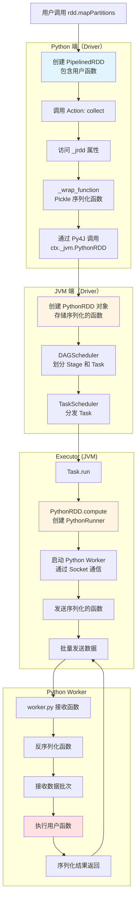
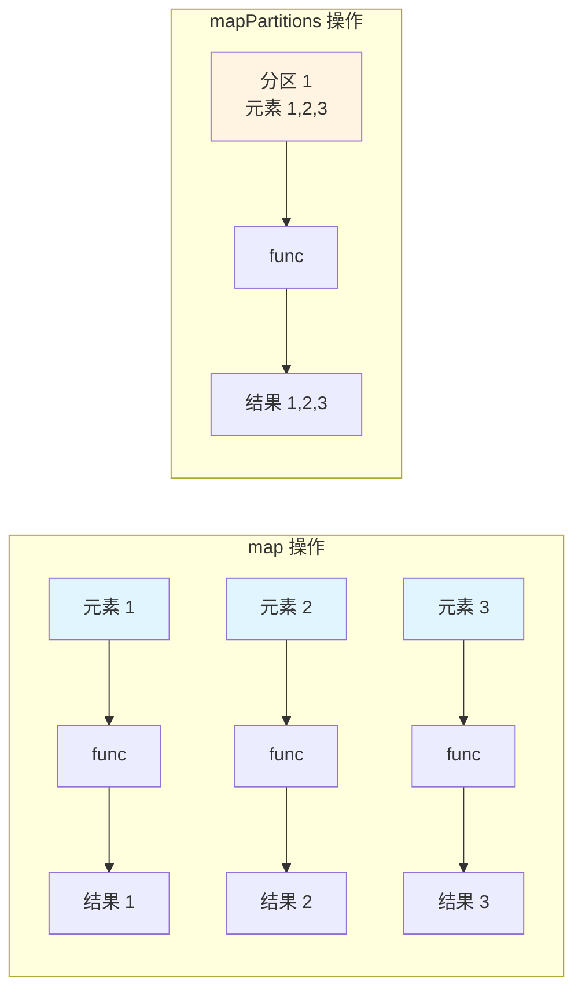
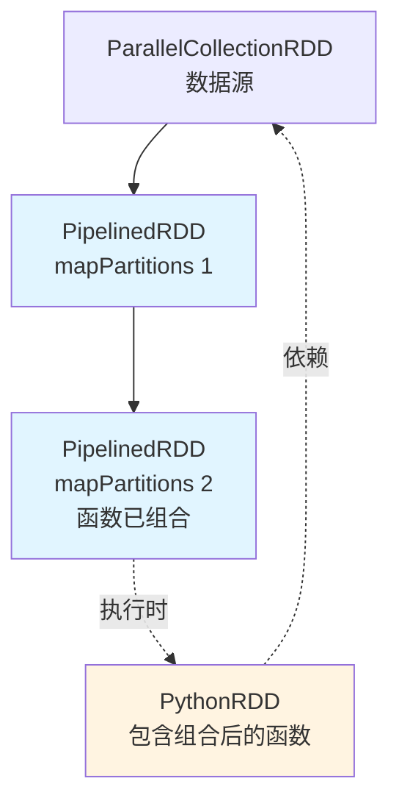
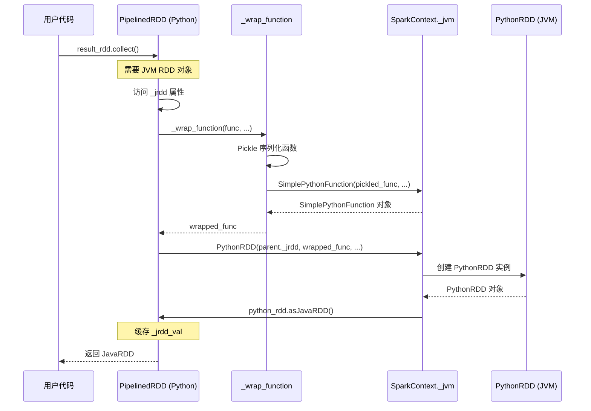
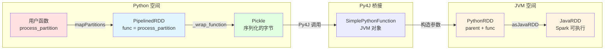
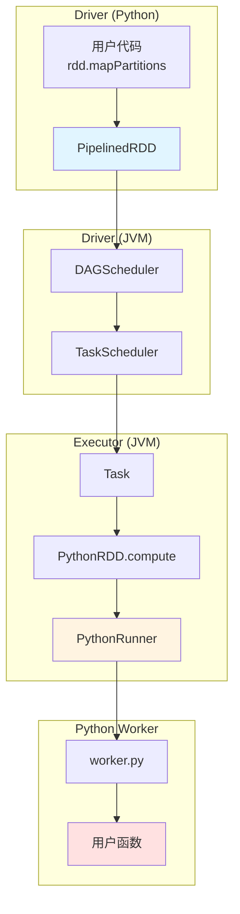
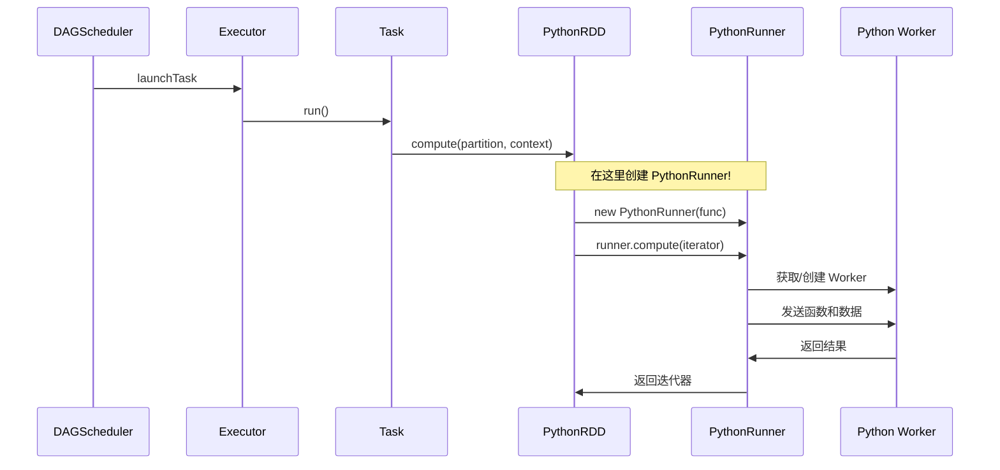

# 深入剖析：PySpark RDD mapPartitions 的内部工作原理
{: .no_toc}

## 目录
{: .no_toc .text-delta}

1. TOC
{:toc}

---

## 引言

`mapPartitions` 是 PySpark 中最强大但也最容易被误用的转换之一。与 `map` 不同，它对整个分区进行操作，这使得它在某些场景下效率更高，但也引入了复杂性。本文将深入探讨当你在 PySpark 中调用 `rdd.mapPartitions(func)` 时，Spark 内部到底发生了什么。

## 示例代码

让我们从一个简单的例子开始：

```python
from pyspark import SparkContext

sc = SparkContext("local[2]", "mapPartitions demo")

# 创建一个 RDD，包含 10 个元素，分成 2 个分区
rdd = sc.parallelize(range(10), 2)

def process_partition(iterator):
    """处理整个分区的函数"""
    for value in iterator:
        yield value * 2

# 应用 mapPartitions
result_rdd = rdd.mapPartitions(process_partition)

# 触发执行
print(result_rdd.collect())
# 输出: [0, 2, 4, 6, 8, 10, 12, 14, 16, 18]
```

这段简单的代码背后隐藏着复杂的跨语言通信和序列化机制。让我们深入探究。

---

## 核心流程概览

在深入细节之前，先了解整个流程的关键步骤：



**关键要点**：

1. **Python 端**：`mapPartitions` 创建 `PipelinedRDD`，多个连续的转换会组合函数
2. **创建 PythonRDD**：当 Action 触发时，访问 `_jrdd` 属性，通过 Py4J 在 JVM 中创建 `PythonRDD`
3. **函数序列化**：Python 函数通过 Pickle 序列化后存储在 `PythonRDD` 中
4. **PythonRunner 创建**：在每个 Task 的 `compute` 方法中创建，负责管理 Python Worker
5. **数据传输**：JVM 和 Python Worker 通过 Socket 以批次方式传输数据

---

## 第一部分：基础概念

### mapPartitions vs map

首先理解两者的区别：

```python
# map: 对每个元素调用一次函数
rdd.map(lambda x: x * 2)
# 函数被调用 10 次（每个元素一次）

# mapPartitions: 对每个分区调用一次函数
rdd.mapPartitions(lambda iterator: [x * 2 for x in iterator])
# 函数被调用 2 次（每个分区一次）
```



### 为什么使用 mapPartitions？

**优势**：
1. **减少函数调用开销**：每个分区只调用一次函数
2. **批量处理**：一次性处理多个元素
3. **共享资源**：在分区级别共享昂贵的资源（如数据库连接）
4. **灵活性**：可以改变元素数量（过滤、展开等）

**典型场景**：
```python
def write_to_database(iterator):
    """为每个分区创建一次数据库连接"""
    conn = create_db_connection()  # 每个分区只创建一次连接
    
    try:
        for record in iterator:
            conn.insert(process(record))
            yield record
    finally:
        conn.close()

rdd.mapPartitions(write_to_database).count()
```

---

## 第二部分：RDD 依赖和血统

### RDD 链的形成

```python
# 创建 RDD 链
rdd1 = sc.parallelize([1, 2, 3, 4], 2)
rdd2 = rdd1.mapPartitions(lambda it: (x * 2 for x in it))
rdd3 = rdd2.mapPartitions(lambda it: (x for x in it if x > 2))
```



**关键点**：
- Python 端：多个 `mapPartitions` 创建 `PipelinedRDD` 链，函数会被组合
- JVM 端：执行时创建单个 `PythonRDD`，包含所有组合后的 Python 函数

---

## 第三部分：从 Python 到 JVM 的转换

### PythonRDD 创建的完整路径

| 步骤 | 触发时机 | 在哪里 | 做什么 |
|------|---------|--------|--------|
| 1️⃣ | 用户调用 `rdd.mapPartitions(func)` | `pyspark/core/rdd.py` | 创建 `PipelinedRDD` 对象，存储函数 |
| 2️⃣ | 用户调用 Action (如 `collect()`) | `pyspark/core/rdd.py` | Spark 内部访问 `PipelinedRDD._jrdd` 属性 |
| 3️⃣ | `_jrdd` 属性被访问 | `pyspark/core/rdd.py` | 调用 `_wrap_function()` 序列化函数 |
| 4️⃣ | `_wrap_function()` 执行 | `pyspark/core/rdd.py` | 通过 Pickle 序列化函数，创建 `SimplePythonFunction` (JVM) |
| 5️⃣ | 创建 JVM RDD | `pyspark/core/rdd.py` | 调用 `ctx._jvm.PythonRDD(parent, func, ...)` |
| 6️⃣ | PythonRDD 构造 | `PythonRDD.scala` | 在 JVM 中创建 `PythonRDD` 实例 |
| 7️⃣ | 返回给 Python | `pyspark/core/rdd.py` | 缓存 `_jrdd_val`，后续直接使用 |

### Python 端：创建 PipelinedRDD

**源码**: `spark/python/pyspark/core/rdd.py`

```python
def mapPartitions(
    self: "RDD[T]", 
    f: Callable[[Iterable[T]], Iterable[U]], 
    preservesPartitioning: bool = False
) -> "RDD[U]":
    def func(_: int, iterator: Iterable[T]) -> Iterable[U]:
        return f(iterator)
    
    return self.mapPartitionsWithIndex(func, preservesPartitioning)
```

**PipelinedRDD 的函数组合**：

```python
class PipelinedRDD(RDD[U], Generic[T, U]):
    def __init__(self, prev: RDD[T], func: Callable, ...):
        if not isinstance(prev, PipelinedRDD) or not prev._is_pipelinable():
            # 新的流水线阶段
            self.func = func
            self._prev_jrdd = prev._jrdd
        else:
            # 组合函数：f3(f2(f1(data)))
            prev_func = prev.func
            def pipeline_func(split: int, iterator: Iterable) -> Iterable:
                return func(split, prev_func(split, iterator))
            
            self.func = pipeline_func
            self._prev_jrdd = prev._prev_jrdd
```

### 触发 PythonRDD 创建：_jrdd 属性

**关键机制**：当 Action（如 `collect()`）触发时，Spark 需要获取 JVM RDD 对象，这时会调用 `PipelinedRDD._jrdd` 属性。

**源码**: `spark/python/pyspark/core/rdd.py`

```python
class PipelinedRDD(RDD[U], Generic[T, U]):
    # ... 
    
    @property
    def _jrdd(self) -> "JavaObject":
        if self._jrdd_val:
            return self._jrdd_val  # 已经创建过
        
        # 步骤 1: 包装 Python 函数
        wrapped_func = _wrap_function(
            self.ctx, 
            self.func,                      # 我们的 mapPartitions 函数
            self._prev_jrdd_deserializer,  # 输入反序列化器
            self._jrdd_deserializer,        # 输出序列化器
            profiler
        )
        
        # 步骤 2: 创建 JVM 的 PythonRDD 对象
        assert self.ctx._jvm is not None
        python_rdd = self.ctx._jvm.PythonRDD(
            self._prev_jrdd.rdd(),           # 父 RDD (JVM)
            wrapped_func,                     # 序列化的 Python 函数
            self.preservesPartitioning,       # 是否保持分区
            self.is_barrier                   # 是否是 barrier stage
        )
        
        # 步骤 3: 转换为 JavaRDD
        self._jrdd_val = python_rdd.asJavaRDD()
        return self._jrdd_val
```

**_wrap_function 的作用**：

**源码**: `spark/python/pyspark/core/rdd.py`

```python
def _wrap_function(sc, func, deserializer, serializer, profiler=None):
    # 打包函数和序列化器
    command = (func, profiler, deserializer, serializer)
    
    # 序列化整个 command
    pickled_command, broadcast_vars, env, includes = _prepare_for_python_RDD(sc, command)
    
    # 创建 JVM SimplePythonFunction 对象
    return sc._jvm.SimplePythonFunction(
        bytearray(pickled_command),  # Pickle 序列化的函数
        env,                         # 环境变量
        includes,                    # Python 文件依赖
        sc.pythonExec,               # Python 可执行文件路径
        sc.pythonVer,                # Python 版本
        broadcast_vars,              # 广播变量
        sc._javaAccumulator          # 累加器
    )
```

**流程图**：



### JVM 端：PythonRDD 类定义

**源码**: `spark/core/src/main/scala/org/apache/spark/api/python/PythonRDD.scala`

```scala
private[spark] class PythonRDD(
    parent: RDD[_],              // 父 RDD (例如 ParallelCollectionRDD)
    func: PythonFunction,        // Python 函数（已序列化）
    preservePartitioning: Boolean,
    isFromBarrier: Boolean = false)
  extends RDD[Array[Byte]](parent) {

  // 继承父 RDD 的分区
  override def getPartitions: Array[Partition] = firstParent.partitions

  // 核心计算方法
  override def compute(split: Partition, context: TaskContext): Iterator[Array[Byte]] = {
    // 在这里创建 PythonRunner！
    val runner = PythonRunner(func, jobArtifactUUID)
    runner.compute(firstParent.iterator(split, context), split.index, context)
  }
}
```

### 对象转换链

下图展示了 Python 对象如何一步步转换为 JVM 对象：



**内存中的对象**：

1. **Python 端**：
   - `PipelinedRDD` 对象：包含 Python 函数引用和 `_prev_jrdd`（指向父 JVM RDD）
   - `_jrdd_val = None`：初始为空，延迟创建

2. **JVM 端（通过 Py4J 创建）**：
   - `SimplePythonFunction`：包含序列化的 Python 代码（字节数组）
   - `PythonRDD`：包含 `SimplePythonFunction` 和父 RDD 引用
   - `JavaRDD`：Spark 内部可以直接执行的 RDD 类型

---

## 第四部分：执行流程

### 整体架构



### PythonRunner 的创建

**关键时刻**：`PythonRunner` 在每个 Task 的 `compute` 方法中被创建



**调用栈**：

```
Executor.launchTask()
  └─> TaskRunner.run()
      └─> Task.run()
          └─> RDD.iterator()
              └─> PythonRDD.compute()          ← 在这里创建 PythonRunner
                  └─> val runner = PythonRunner(func, jobArtifactUUID)
                  └─> runner.compute(...)       ← 执行
```

**源码**: `spark/core/src/main/scala/org/apache/spark/api/python/PythonRDD.scala`

```scala
override def compute(split: Partition, context: TaskContext): Iterator[Array[Byte]] = {
  val runner = PythonRunner(func, jobArtifactUUID)  // 创建
  runner.compute(firstParent.iterator(split, context), split.index, context)  // 执行
}
```

### Python Worker 的启动

**源码**: `spark/core/src/main/scala/org/apache/spark/api/python/PythonWorkerFactory.scala`

```scala
class PythonWorkerFactory {
  private val workerPool = new mutable.Queue[(Socket, Int)]()
  
  def create(): Socket = {
    synchronized {
      if (workerPool.nonEmpty && reuseWorker) {
        workerPool.dequeue()._1  // 重用
      } else {
        startWorker()  // 创建新进程
      }
    }
  }
  
  def startWorker(): Socket = {
    val serverSocket = new ServerSocket(0)
    val pb = new ProcessBuilder(pythonExec, "-m", workerModule)
    val worker = pb.start()
    serverSocket.accept()  // Worker 连接回来
  }
}
```

---

## 第五部分：数据传输协议

### Python Worker 的主循环

**源码**: `spark/python/pyspark/worker.py`

```python
def main(infile, outfile):
    # 1. 读取函数
    command_length = read_int(infile)
    command = pickle.loads(infile.read(command_length))
    func = command['func']  # 你的 process_partition 函数
    
    # 2. 处理数据批次
    while True:
        batch_length = read_int(infile)
        if batch_length == -1:  # 结束标记
            break
        
        # 反序列化批次
        batch = pickle.loads(infile.read(batch_length))
        
        # 应用用户函数
        input_iterator = iter(batch)
        output_iterator = func(input_iterator)
        
        # 收集并序列化结果
        results = list(output_iterator)
        result_data = pickle.dumps(results)
        write_int(len(result_data), outfile)
        outfile.write(result_data)
        outfile.flush()
    
    # 3. 发送结束标记
    write_int(-1, outfile)
```

### 批次处理

**源码**: `spark/core/src/main/scala/org/apache/spark/api/python/PythonRDD.scala`

```scala
class BatchIterator(iter: Iterator[Any], batchSize: Int) {
  def next(): Array[Byte] = {
    val batch = new mutable.ArrayBuffer[Any]
    var count = 0
    while (iter.hasNext && count < batchSize) {
      batch += iter.next()
      count += 1
    }
    pickler.dumps(batch)  // 序列化整个批次
  }
}
```

**批次大小说明**：

- **对于 RDD 操作（mapPartitions）**：默认使用 `AutoBatchedSerializer`，自动决定批次大小
  - 可通过 `SparkContext(batchSize=N)` 参数设置
  - 默认 `batchSize=0`，表示自动批处理
  
- **对于 SQL UDFs**：批次大小硬编码为 **100**
  - 源码位置：`PythonRunner.scala:181` → `protected val batchSizeForPythonUDF: Int = 100`
  - 通过环境变量 `PYTHON_UDF_BATCH_SIZE` 传递给 Python Worker
  - **无法通过配置修改**

**相关配置**（这些是真实存在的）：
- `spark.python.worker.memory` = "512m"（默认）- Python Worker 内存限制
- `spark.python.worker.reuse` = true（默认）- 是否重用 Python Worker

---


## 进一步阅读

1. [PySpark 内部机制](https://cwiki.apache.org/confluence/display/SPARK/PySpark+Internals)
2. [RDD Programming Guide](https://spark.apache.org/docs/latest/rdd-programming-guide.html)
3. [Performance Tuning](https://spark.apache.org/docs/latest/tuning.html)
4. [Python Worker 源码](https://github.com/apache/spark/blob/master/python/pyspark/worker.py)

---

*本文基于 Apache Spark 4.1.0-SNAPSHOT 源代码分析。*
