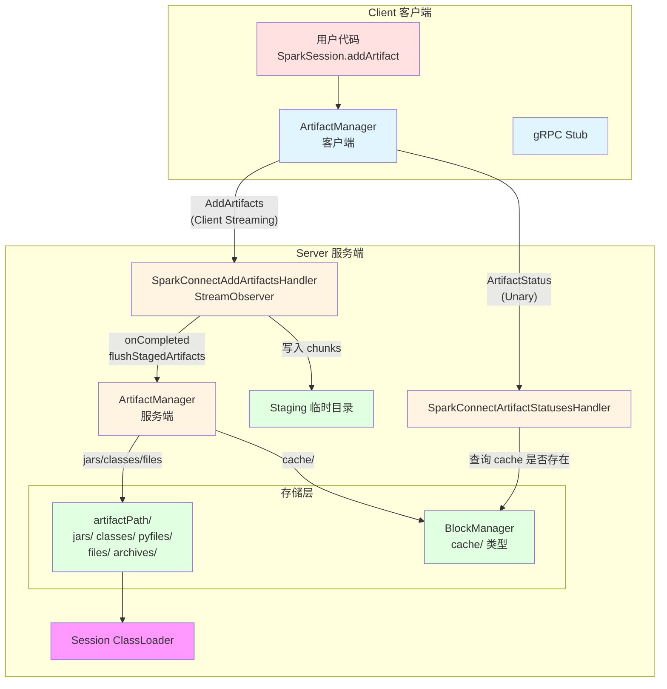
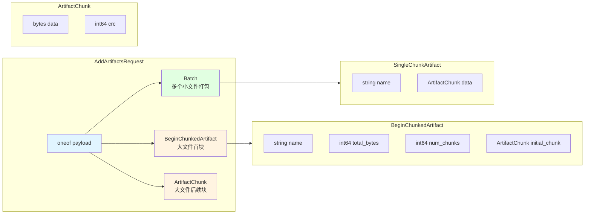
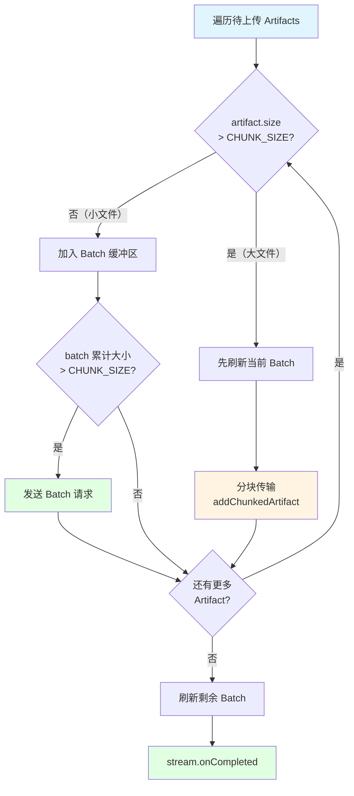
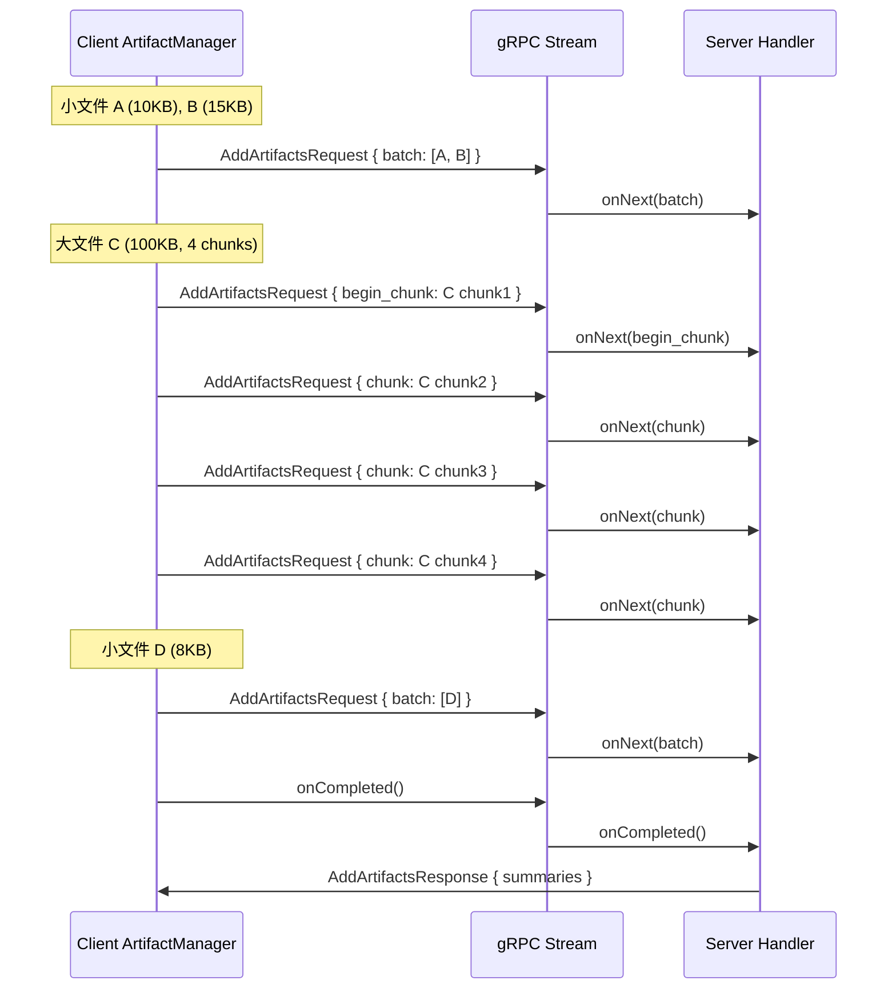
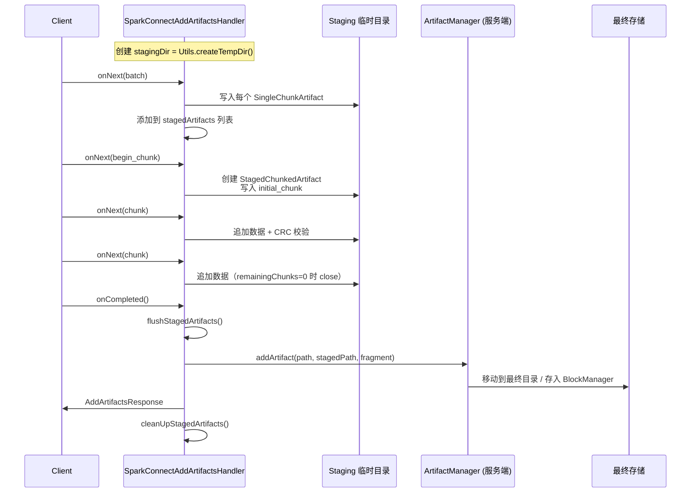
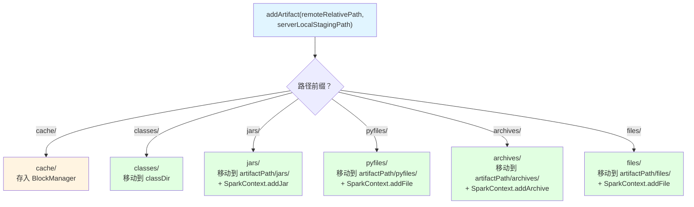
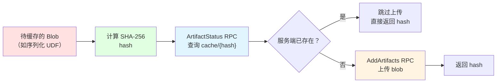
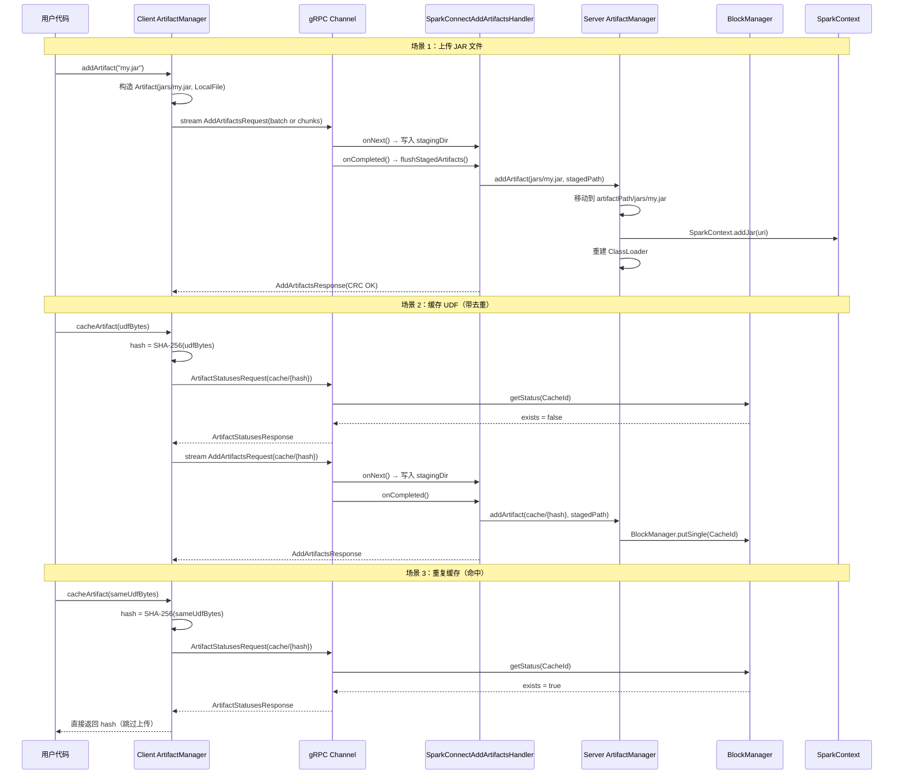

# Spark Connect Artifact 管理机制：addArtifacts 与 artifactStatus 深度解析
{: .no_toc}

## 目录
{: .no_toc .text-delta}

1. TOC
{:toc}

本文基于 Spark 4.2 学习 Spark Connect 中 Artifact 的上传（`addArtifacts`）和状态查询（`artifactStatus`）机制。

---

## 概述

在 Spark Connect 的客户端-服务器架构中，用户代码运行在客户端进程中，而 Spark 运行时位于远程服务端。当用户需要向 Spark 提交 JAR 包、class 文件、Python 文件、数据文件等资源时，就需要一种可靠的机制将这些**Artifact（工件）**从客户端传输到服务端。

Spark Connect 通过两个核心 gRPC API 实现了这一需求：

| API | 类型 | 作用 |
|-----|------|------|
| `AddArtifacts` | Client Streaming RPC | 将本地文件分块上传到服务端 |
| `ArtifactStatus` | Unary RPC | 查询 Artifact 是否已存在于服务端（用于缓存判断） |

这两个 API 协同工作，实现了**高效、可靠、支持缓存去重**的 Artifact 传输机制。

---

## 示例代码

以 Scala 客户端为例，向 Spark Connect 会话添加 Artifact 非常简单：

```scala
val spark = SparkSession.builder()
  .remote("sc://localhost:15002")
  .getOrCreate()

// 添加 JAR
spark.addArtifact("/path/to/my-udf.jar")

// 添加 class 文件
spark.addArtifact(bytesOfClass, "com/example/MyUDF.class")

// 添加 Maven 依赖（Ivy 协议）
spark.addArtifact(new URI("ivy://org.example:my-lib:1.0"))

// 缓存 in-memory blob（如序列化后的 UDF）
val hash = spark.client.artifactManager.cacheArtifact(serializedUdfBytes)
```

这段简单的代码背后涉及 gRPC 流式传输、分块协议、CRC 校验、服务端 Artifact 存储和 ClassLoader 管理等一系列复杂机制。让我们深入探究。

---

## 整体架构



---

## Protobuf 协议定义

在深入实现细节之前，先了解两个 gRPC API 的协议定义。

**源码**: `spark/sql/connect/common/src/main/protobuf/spark/connect/base.proto`

```protobuf
service SparkConnectService {
  rpc AddArtifacts(stream AddArtifactsRequest) returns (AddArtifactsResponse) {}
  rpc ArtifactStatus(ArtifactStatusesRequest) returns (ArtifactStatusesResponse) {}
}
```

### AddArtifactsRequest

`AddArtifactsRequest` 通过 `oneof payload` 支持三种传输模式：



### AddArtifactsResponse

```protobuf
message AddArtifactsResponse {
  string session_id = 2;
  string server_side_session_id = 3;
  repeated ArtifactSummary artifacts = 1;

  message ArtifactSummary {
    string name = 1;
    bool is_crc_successful = 2;
  }
}
```

服务端返回每个 Artifact 的 CRC 校验结果，客户端可据此决定是否重传。

### ArtifactStatusesRequest / Response

```protobuf
message ArtifactStatusesRequest {
  string session_id = 1;
  UserContext user_context = 2;
  repeated string names = 4;  // 如 "cache/abc123"
}

message ArtifactStatusesResponse {
  map<string, ArtifactStatus> statuses = 1;

  message ArtifactStatus {
    bool exists = 1;
  }
}
```

---

## 第一部分：addArtifacts 客户端流程

### Artifact 类型与命名约定

客户端将不同类型的 Artifact 映射为带前缀的路径名：

**源码**: `spark/sql/api/src/main/scala/org/apache/spark/sql/Artifact.scala`

```scala
object Artifact {
  val CLASS_PREFIX: Path = Paths.get("classes")
  val JAR_PREFIX: Path = Paths.get("jars")
  val CACHE_PREFIX: Path = Paths.get("cache")
}
```

| 类型 | 路径前缀 | 示例 | 场景 |
|------|---------|------|------|
| JAR | `jars/` | `jars/my-udf.jar` | 用户 JAR 包 |
| Class | `classes/` | `classes/com/example/Foo.class` | REPL 动态编译的类 |
| Cache | `cache/` | `cache/a1b2c3d4...` | 序列化 UDF 等二进制数据 |
| PyFile | `pyfiles/` | `pyfiles/my_module.zip` | Python 文件（Python 客户端） |
| Archive | `archives/` | `archives/data.tar.gz` | 归档文件 |
| File | `files/` | `files/config.json` | 普通文件 |

每个 `Artifact` 对象包含一个**相对路径**（`path`）和一个**本地数据源**（`LocalData`），后者可以是本地文件（`LocalFile`）或内存数据（`InMemory`）。

### 分块传输策略

客户端 `ArtifactManager` 采用**智能分块策略**来高效传输 Artifact。每个 chunk 的大小为 **32 KB**，这是 gRPC 推荐的消息体大小。

**源码**: `spark/sql/connect/common/src/main/scala/org/apache/spark/sql/connect/client/ArtifactManager.scala`

```scala
class ArtifactManager(...) {
  // 遵循 gRPC 推荐的 32KB chunk 大小
  private val CHUNK_SIZE: Int = 32 * 1024
}
```

传输策略分为两种：



核心实现在 `addArtifactsImpl` 方法中：

```scala
private[client] def addArtifactsImpl(artifacts: Iterable[Artifact]): Unit = {
  val promise = Promise[Seq[ArtifactSummary]]()
  val responseHandler = new StreamObserver[proto.AddArtifactsResponse] { ... }
  val stream = stub.addArtifacts(responseHandler)
  val currentBatch = mutable.Buffer.empty[Artifact]
  var currentBatchSize = 0L

  artifacts.iterator.foreach { artifact =>
    val size = artifact.storage.size
    if (size > CHUNK_SIZE) {
      // 大文件：先刷新 batch，再分块传输
      if (currentBatch.nonEmpty) { writeBatch() }
      addChunkedArtifact(artifact, stream)
    } else {
      // 小文件：累积到 batch
      if (currentBatchSize + size > CHUNK_SIZE) { writeBatch() }
      addToBatch(artifact, size)
    }
  }
  if (currentBatch.nonEmpty) { writeBatch() }
  stream.onCompleted()
  SparkThreadUtils.awaitResultNoSparkExceptionConversion(promise.future, Duration.Inf)
}
```

### Batch 模式（小文件）

多个小文件（每个 <= 32KB）被打包到一个 `AddArtifactsRequest.Batch` 中一次发送，减少 RPC 次数：

```scala
private def addBatchedArtifacts(
    artifacts: Seq[Artifact],
    stream: StreamObserver[proto.AddArtifactsRequest]): Unit = {
  val builder = proto.AddArtifactsRequest.newBuilder()
    .setSessionId(sessionId)
  artifacts.foreach { artifact =>
    val in = new CheckedInputStream(artifact.storage.stream, new CRC32)
    val data = proto.AddArtifactsRequest.ArtifactChunk.newBuilder()
      .setData(ByteString.readFrom(in))
      .setCrc(in.getChecksum.getValue)  // 每个 artifact 计算 CRC32
    builder.getBatchBuilder.addArtifactsBuilder()
      .setName(artifact.path.toString)
      .setData(data)
  }
  stream.onNext(builder.build())
}
```

### Chunked 模式（大文件）

大文件（> 32KB）被拆分为多个 chunk，分多次 RPC 发送：

```scala
private def addChunkedArtifact(
    artifact: Artifact,
    stream: StreamObserver[proto.AddArtifactsRequest]): Unit = {
  val in = new CheckedInputStream(artifact.storage.stream, new CRC32)

  // 第一个请求：BeginChunkedArtifact（包含元信息 + 首个 chunk）
  var dataChunk = readNextChunk(in)
  builder.getBeginChunkBuilder
    .setName(artifact.path.toString)
    .setTotalBytes(artifact.size)
    .setNumChunks(getNumChunks(artifact.size))
    .setInitialChunk(artifactChunkBuilder.setData(dataChunk).setCrc(...))
  stream.onNext(builder.build())

  // 后续请求：只包含 ArtifactChunk 数据
  dataChunk = readNextChunk(in)
  while (!dataChunk.isEmpty) {
    builder.setChunk(artifactChunkBuilder.setData(dataChunk).setCrc(...))
    stream.onNext(builder.build())
    dataChunk = readNextChunk(in)
  }
}
```

整个传输过程示意：



---

## 第二部分：addArtifacts 服务端流程

### SparkConnectAddArtifactsHandler

服务端通过 `SparkConnectAddArtifactsHandler` 接收客户端的流式请求。它实现了 `StreamObserver[AddArtifactsRequest]` 接口。

**源码**: `spark/sql/connect/server/src/main/scala/org/apache/spark/sql/connect/service/SparkConnectAddArtifactsHandler.scala`



#### onNext：接收并暂存数据

```scala
override def onNext(req: AddArtifactsRequest): Unit = {
  if (this.holder == null) {
    this.holder = SparkConnectService.getOrCreateIsolatedSession(
      req.getUserContext.getUserId, req.getSessionId, previousSessionId)
  }

  if (req.hasBeginChunk) {
    require(chunkedArtifact == null)
    chunkedArtifact = writeArtifactToFile(req.getBeginChunk)
  } else if (req.hasChunk) {
    require(chunkedArtifact != null && !chunkedArtifact.isFinished)
    chunkedArtifact.write(req.getChunk)
    if (chunkedArtifact.isFinished) {
      chunkedArtifact.close()
      chunkedArtifact = null
    }
  } else if (req.hasBatch) {
    req.getBatch.getArtifactsList.forEach(artifact =>
      writeArtifactToFile(artifact).close())
  }
}
```

#### StagedArtifact 与 CRC 校验

服务端在写入每个 chunk 时，都会验证 CRC32 校验码：

```scala
class StagedArtifact(val name: String) {
  val stagedPath: Path = ArtifactUtils.concatenatePaths(stagingDir, path)
  private val checksumOut = new CheckedOutputStream(countingOut, new CRC32)
  private val overallChecksum = new CRC32()

  def write(dataChunk: proto.AddArtifactsRequest.ArtifactChunk): Unit = {
    dataChunk.getData.writeTo(checksumOut)
    overallChecksum.update(dataChunk.getData.toByteArray)
    // 验证此 chunk 的 CRC 是否与客户端发送的一致
    updateCrc(checksumOut.getChecksum.getValue == dataChunk.getCrc)
    checksumOut.getChecksum.reset()
  }
}
```

对于大文件，`StagedChunkedArtifact` 额外跟踪 chunk 数量和总字节数：

```scala
class StagedChunkedArtifact(name: String, numChunks: Long, totalBytes: Long)
    extends StagedArtifact(name) {
  private var remainingChunks = numChunks
  private var totalBytesProcessed = 0L

  def isFinished: Boolean = remainingChunks == 0

  override def close(): Unit = {
    if (remainingChunks != 0 || totalBytesProcessed != totalBytes) {
      throw new RuntimeException(
        s"Missing data chunks for artifact: $name. ...")
    }
    super.close()
  }
}
```

#### onCompleted：刷新到最终存储

当客户端流结束时，`onCompleted` 将所有暂存的 Artifact 刷新到最终存储：

```scala
override def onCompleted(): Unit = {
  val artifactSummaries = flushStagedArtifacts()
  val builder = proto.AddArtifactsResponse.newBuilder()
  builder.setSessionId(holder.sessionId)
  artifactSummaries.foreach(summary => builder.addArtifacts(summary))
  cleanUpStagedArtifacts()
  responseObserver.onNext(builder.build())
  responseObserver.onCompleted()
}
```

`flushStagedArtifacts` 会检查 CRC 是否通过，只有 CRC 校验成功的 Artifact 才会被存储：

```scala
protected def flushStagedArtifacts(): Seq[ArtifactSummary] = {
  stagedArtifacts.map { artifact =>
    if (artifact.getCrcStatus.contains(true)) {
      addStagedArtifactToArtifactManager(artifact)
    }
    artifact.summary()  // 包含 name 和 is_crc_successful
  }.toSeq
}
```

---

## 第三部分：服务端 ArtifactManager 存储

当 Artifact 通过 CRC 校验后，服务端的 `ArtifactManager` 根据路径前缀将其分发到不同的存储位置。

**源码**: `spark/sql/core/src/main/scala/org/apache/spark/sql/artifact/ArtifactManager.scala`



### 存储目录结构

每个 Session 的 Artifact 存储在独立的目录下，实现了 **Session 级别隔离**：

```
artifactRootDirectory/
└── <sessionUUID>/
    ├── jars/
    │   └── my-udf.jar
    ├── classes/
    │   └── com/example/MyUDF.class
    ├── pyfiles/
    │   └── my_module.zip
    ├── archives/
    │   └── data.tar.gz
    └── files/
        └── config.json
```

### cache 类型的特殊处理

`cache/` 类型的 Artifact（通常是序列化的 UDF）不存储为文件，而是存入 Spark 的 `BlockManager`：

```scala
if (normalizedRemoteRelativePath.startsWith(s"cache${File.separator}")) {
  val hash = normalizedRemoteRelativePath.toString.stripPrefix(s"cache${File.separator}")
  val blockManager = session.sparkContext.env.blockManager
  val blockId = CacheId(sessionUUID = session.sessionUUID, hash = hash)

  val updater = blockManager.TempFileBasedBlockStoreUpdater(
    blockId = blockId,
    level = storageLevel,
    classTag = implicitly[ClassTag[Array[Byte]]],
    tmpFile = tmpFile,
    blockSize = tmpFile.length(),
    tellMaster = false)
  updater.save()
  hashToCachedIdMap.put(blockId.hash, new RefCountedCacheId(blockId))
}
```

`CacheId` 由 `sessionUUID` + `hash` 组成，确保了缓存在 Session 之间的隔离。

### JAR 与 Class 文件的 ClassLoader 管理

当 JAR 或 class 文件被添加后，服务端会构建一个 **Session 专属的 ClassLoader**，用于加载用户提交的类：

```scala
private def buildClassLoader: ClassLoader = {
  val urls = (getAddedJars :+ classDir.toUri.toURL).toArray
  val userClasspathFirst = SparkEnv.get.conf.get(EXECUTOR_USER_CLASS_PATH_FIRST)
  val fallbackClassLoader = session.sharedState.jarClassLoader

  if (userClasspathFirst) {
    new ChildFirstURLClassLoader(urls, fallbackClassLoader)
  } else {
    new URLClassLoader(urls, fallbackClassLoader)
  }
}
```

当 Spark 执行用户任务时，通过 `withResources` 方法设置正确的 ClassLoader 和 `JobArtifactState`：

```scala
def withResources[T](f: => T): T = withClassLoaderIfNeeded {
  JobArtifactSet.withActiveJobArtifactState(state) {
    f
  }
}
```

这确保了每个 Session 只能看到自己上传的 Artifact。

---

## 第四部分：artifactStatus 缓存查询机制

`artifactStatus` API 的核心目的是**避免重复上传**。客户端在上传 `cache/` 类型的 Artifact 之前，先查询服务端是否已存在相同内容。

### 客户端：先查后传

**源码**: `spark/sql/connect/common/src/main/scala/org/apache/spark/sql/connect/client/ArtifactManager.scala`



单个 Artifact 的缓存逻辑：

```scala
def cacheArtifact(blob: Array[Byte]): String = {
  val hash = sha256Hex(blob)
  if (!isCachedArtifact(hash)) {
    addArtifacts(newCacheArtifact(hash, new Artifact.InMemory(blob)) :: Nil)
  }
  hash
}
```

批量缓存时，通过一次 `getCachedArtifacts` RPC 批量查询，减少网络往返：

```scala
def cacheArtifacts(blobs: Array[Array[Byte]]): Seq[String] = {
  val hashes = blobs.map(sha256Hex).toSeq
  val uniqueHashes = hashes.distinct

  // 批量查询哪些已缓存
  val cachedHashes = getCachedArtifacts(uniqueHashes)

  // 只上传不存在的 Artifact
  val uniqueBlobsToUpload = scala.collection.mutable.ListBuffer[Artifact]()
  for ((blob, hash) <- blobs.zip(hashes)) {
    if (!cachedHashes.contains(hash) && !seenHashes.contains(hash)) {
      uniqueBlobsToUpload += newCacheArtifact(hash, new Artifact.InMemory(blob))
    }
  }

  if (uniqueBlobsToUpload.nonEmpty) {
    addArtifacts(uniqueBlobsToUpload.toList)
  }
  hashes
}
```

`isCachedArtifact` 构建 `ArtifactStatusesRequest` 并发起 Unary RPC 调用：

```scala
private[client] def isCachedArtifact(hash: String): Boolean = {
  val artifactName = s"${Artifact.CACHE_PREFIX}/$hash"
  val request = proto.ArtifactStatusesRequest.newBuilder()
    .setSessionId(sessionId)
    .addAllNames(Arrays.asList(artifactName))
    .build()
  val response = bstub.artifactStatus(request)
  val statuses = response.getStatusesMap
  if (statuses.containsKey(artifactName)) {
    statuses.get(artifactName).getExists
  } else false
}
```

### 服务端：查询 BlockManager

**源码**: `spark/sql/connect/server/src/main/scala/org/apache/spark/sql/connect/service/SparkConnectArtifactStatusesHandler.scala`

服务端处理逻辑非常简洁——只有 `cache/` 前缀的 Artifact 才参与状态查询：

```scala
class SparkConnectArtifactStatusesHandler(...) {

  def handle(request: proto.ArtifactStatusesRequest): Unit = {
    val holder = SparkConnectService.getOrCreateIsolatedSession(...)

    request.getNamesList().iterator().asScala.foreach { name =>
      val status = proto.ArtifactStatusesResponse.ArtifactStatus.newBuilder()
      val exists = if (name.startsWith("cache/")) {
        cacheExists(userId, sessionId, previousSessionId,
          hash = name.stripPrefix("cache/"))
      } else false
      builder.putStatuses(name, status.setExists(exists).build())
    }
    responseObserver.onNext(builder.build())
    responseObserver.onCompleted()
  }

  protected def cacheExists(..., hash: String): Boolean = {
    val session = SparkConnectService
      .getOrCreateIsolatedSession(userId, sessionId, previouslySeenSessionId)
      .session
    val blockManager = session.sparkContext.env.blockManager
    blockManager.getStatus(CacheId(session.sessionUUID, hash)).isDefined
  }
}
```

关键点：**只有 `cache/` 类型的 Artifact 支持状态查询**。JAR、class 文件等其他类型始终返回 `exists = false`，每次都会重新上传。

---

## 端到端流程总结



---

## 关键设计总结

| 设计要点 | 实现方式 |
|---------|---------|
| **高效传输** | 小文件 Batch 打包、大文件分块（32KB chunk），减少 RPC 开销 |
| **数据完整性** | 每个 chunk 携带 CRC32 校验码，服务端逐 chunk 验证 |
| **缓存去重** | `cache/` 类型使用 SHA-256 哈希，上传前通过 `ArtifactStatus` 查询避免重复上传 |
| **Session 隔离** | 每个 Session 使用独立目录和 `CacheId(sessionUUID, hash)` 实现存储隔离 |
| **ClassLoader 隔离** | 每个 Session 构建独立的 `URLClassLoader`，包含该 Session 上传的 JAR 和 class 文件 |
| **两阶段存储** | 先写入 staging 临时目录，CRC 校验通过后再移动到最终位置 |
| **引用计数** | cache block 使用 `RefCountedCacheId` 支持 Session clone 场景下的共享和清理 |

---

## 配置参数

| 配置参数 | 默认值 | 描述 |
|---------|--------|------|
| `spark.sql.artifact.manager.cache.storageLevel` | `MEMORY_AND_DISK_SER` | cache 类型 Artifact 在 BlockManager 中的存储级别 |
| `spark.sql.artifact.session.isolation.enabled` | `true` | 是否启用 Session 级别的 Artifact 隔离 |
| `spark.sql.artifact.session.isolation.alwaysApplyClassLoader` | `false` | 即使没有添加任何 Artifact，是否也应用 Session ClassLoader |
| `spark.connect.scalaUdf.stubPrefixes` | (空) | 为 Connect UDF 提供的类加载 stub 前缀 |
| `spark.executor.userClassPathFirst` | `false` | 用户类路径是否优先于系统类路径 |

---

## 总结

1. Spark Connect 通过 `AddArtifacts`（Client Streaming RPC）和 `ArtifactStatus`（Unary RPC）两个 gRPC API 实现了客户端到服务端的 Artifact 传输
2. 客户端 `ArtifactManager` 采用智能分块策略：小文件 Batch 打包、大文件按 32KB 分块流式传输，每个 chunk 携带 CRC32 校验码
3. 服务端 `SparkConnectAddArtifactsHandler` 采用两阶段存储模式：先写入 staging 临时目录，CRC 校验通过后再由服务端 `ArtifactManager` 分发到最终位置
4. 服务端根据路径前缀（`jars/`、`classes/`、`cache/` 等）将 Artifact 分发到不同存储：文件系统目录或 BlockManager
5. `ArtifactStatus` API 仅支持 `cache/` 类型的 Artifact 状态查询，用于在上传前通过 SHA-256 哈希避免重复上传
6. 每个 Session 拥有独立的存储目录、独立的 ClassLoader 和独立的 `JobArtifactState`，实现了完整的 Session 级别隔离

---

*本文基于 Apache Spark 4.2.0 源代码分析。*
