# Spark Connect 服务端：ExecutePlan、ReattachExecute 与 ReleaseExecute 详解
{: .no_toc}

## 目录
{: .no_toc .text-delta}

1. TOC
{:toc}

本文基于 Spark 4.2 学习 Spark Connect 服务端如何处理 `ExecutePlan`、`ReattachExecute` 和
`ReleaseExecute` 这三个 RPC，重点关注可重连（reattachable）执行模型、响应缓冲机制，
以及控制流生命周期和清理行为的配置参数。

> **阅读范围：** 仅涉及服务端执行管理。不涉及底层 gRPC 连接建立与传输细节，也不深入
> DAG/RDD 调度内部实现。

---

## 示例代码

```python
from pyspark.sql import SparkSession

spark = SparkSession.builder \
    .remote("sc://localhost:15002") \
    .getOrCreate()

df = spark.createDataFrame([(1, "Alice"), (2, "Bob"), (3, "Charlie")], ["id", "name"])
result = df.filter("id > 1").collect()
print(result)
```

当客户端调用 `collect()` 时，底层会发送 `ExecutePlan` RPC 到 Spark Connect 服务端。服务端执行查询并以流式方式返回结果。如果响应流因超时或大小限制而中断，客户端会自动通过 `ReattachExecute` 重新连接继续接收，整个过程对用户透明。让我们深入探究服务端的实现细节。

---

## 1. 核心组件

| 组件 | 职责 |
|------|------|
| `SparkConnectService` | gRPC 服务入口 — 将每个 RPC 分发到对应的处理器 |
| `SparkConnectExecutePlanHandler` | 处理 `ExecutePlan` — 创建新执行或重连已有执行 |
| `SparkConnectReattachExecuteHandler` | 处理 `ReattachExecute` — 恢复已脱离（detached）的执行 |
| `SparkConnectReleaseExecuteHandler` | 处理 `ReleaseExecute` — 释放缓冲响应或移除执行 |
| `SparkConnectExecutionManager` | 全局执行注册表，管理所有存活的 `ExecuteHolder`；定期清理被遗弃的执行 |
| `ExecuteHolder` | 单次操作的状态容器：执行计划、会话、响应观察者、已连接的发送器 |
| `ExecuteThreadRunner` | 后台线程，运行执行计划并产生响应 |
| `ExecuteResponseObserver` | 线程安全的响应缓冲区，连接生产者（runner）和消费者（sender） |
| `ExecuteGrpcResponseSender` | 从观察者读取响应，写入 gRPC 响应流 |

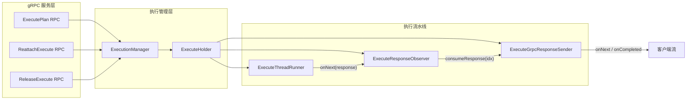

---

## 2. 执行生命周期总览

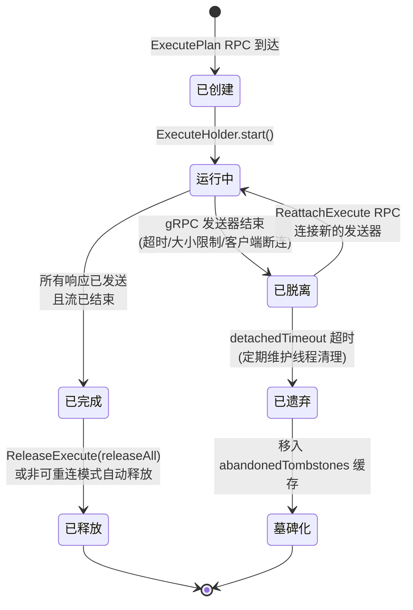

### 关键概念

- **已连接（Attached）** — 有一个 `ExecuteGrpcResponseSender` 正在活跃地消费响应
  并流式发送给客户端。此时 `lastAttachedRpcTimeNs = None`。
- **已脱离（Detached）** — 没有发送器连接。`lastAttachedRpcTimeNs = Some(时间戳)`。
  后台执行线程可能仍在运行并将响应写入缓冲区。
- **已遗弃（Abandoned）** — 脱离时间超过 `detachedTimeout` 的执行。被定期维护线程
  移除，并放入墓碑缓存，这样客户端重试时会收到 `OPERATION_ABANDONED` 错误。

---

## 3. ExecutePlan RPC

当客户端发送 `ExecutePlanRequest` 时，处理器会解析会话并构建
`ExecuteKey(userId, sessionId, operationId)`。可能出现三种结果：

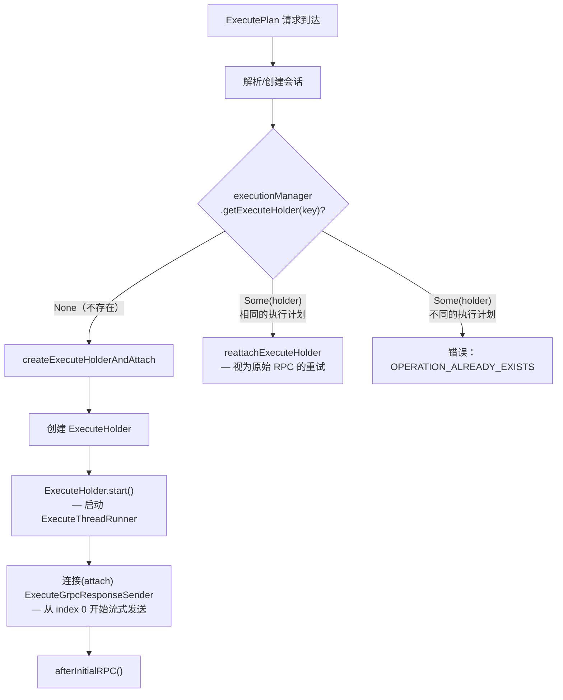

### `createExecuteHolderAndAttach` 内部流程

1. **创建** — `ExecuteHolder` 被注册到 `executions` 映射表和对应的会话中。
2. **启动** — `ExecuteThreadRunner.start()` 启动后台线程，通过
   `SparkConnectPlanExecution.handlePlan(responseObserver)` 执行计划。
   响应流入 `ExecuteResponseObserver`。
3. **连接发送器 attach sender** — 创建一个新的 `ExecuteGrpcResponseSender`，绑定 gRPC
   `StreamObserver`，从 index 0 开始消费响应。
4. **`afterInitialRPC()`** — 如果发送器此时已经脱离（例如执行速度很快，发送器已退出），
   则设置 `lastAttachedRpcTimeNs`，启动脱离超时计时。

---

## 4. ReattachExecute RPC

客户端调用 `ReattachExecute` 来恢复接收之前通过 `ExecutePlan` 启动的执行的响应。
这是可重连协议的核心。

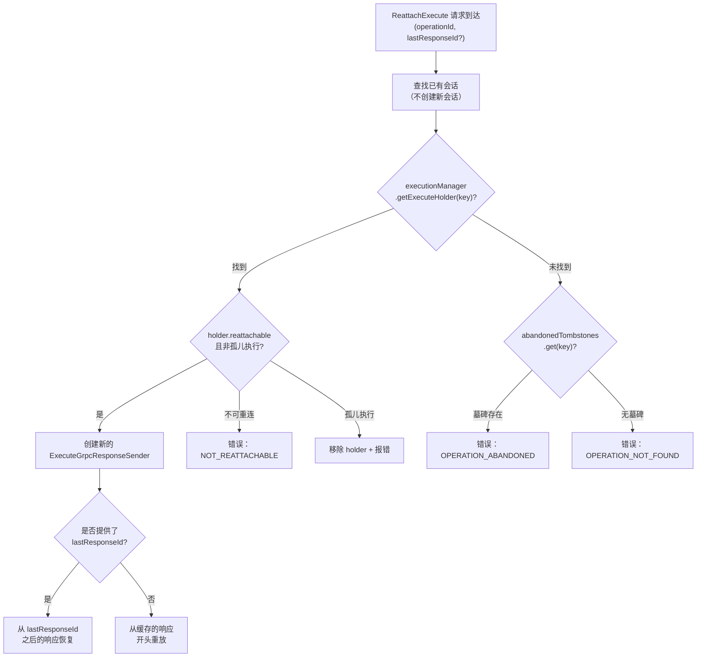

### `lastResponseId` 的工作原理

流中的每个响应都会被分配一个唯一的 `responseId`（UUID）。客户端追踪它成功接收的
最后一个 `responseId`。重连时：

1. `responseObserver.getResponseIndexById(lastResponseId)` 将 `responseId`
   解析为流索引（stream index）。
2. 新的发送器从 `lastConsumedIndex + 1` 开始消费，跳过已经发送过的响应。

这之所以可行，是因为 `ExecuteResponseObserver` 保留了一个最近已发送响应的保留缓冲区
（由 `observerRetryBufferSize` 控制）。

---

## 5. ReleaseExecute RPC

`ReleaseExecute` 允许客户端显式管理服务端资源：

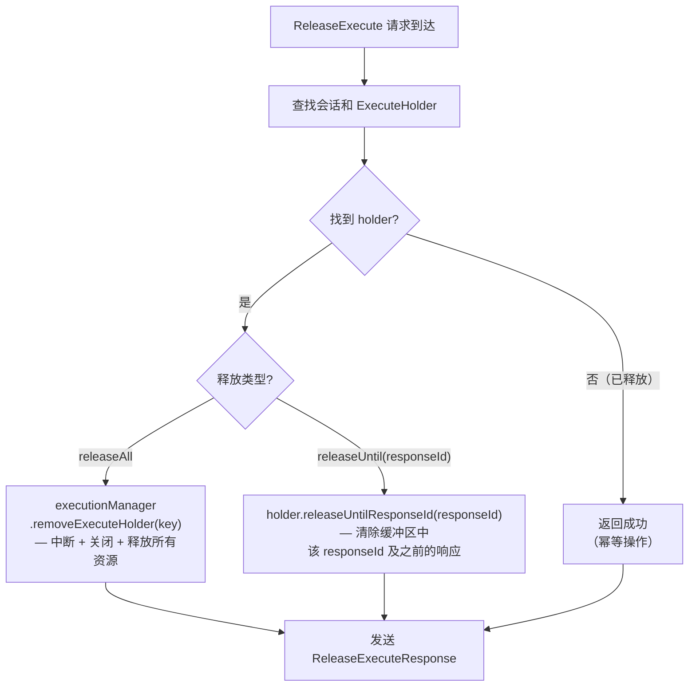

- **`releaseAll`** — 客户端已完成。执行被中断（如果仍在运行），从管理器中移除，
  所有缓存的响应被释放。
- **`releaseUntil(responseId)`** — 客户端确认已消费到 `responseId` 为止的响应。
  服务端可以从缓冲区中丢弃这些响应以释放内存。执行继续进行。

---

## 6. 生产者-消费者流水线

执行流水线包含两个线程和一个共享缓冲区：

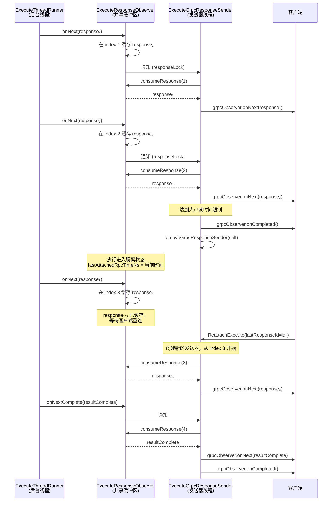

### 背压机制（可重连模式）

在可重连模式下，发送器在独立线程中运行（而非 gRPC 线程），使用
`ServerCallStreamObserver.isReady()` 配合 `OnReadyHandler` 回调实现背压控制。
只有当 gRPC 传输层发出就绪信号时，发送器才会调用 `onNext()`，防止无限制地排队。

在非可重连模式下，发送器直接在 gRPC 线程中运行，没有流量控制，也没有大小/时间限制。
当流结束时，执行会被立即移除。

---

## 7. 配置参数深入解析

### 7.1 `spark.connect.execute.manager.detachedTimeout`

| 属性 | 值 |
|------|-----|
| **配置键** | `spark.connect.execute.manager.detachedTimeout` |
| **默认值** | `5m`（5 分钟） |
| **单位** | 毫秒（支持时间字符串如 `5m`、`300000`） |

**控制内容：** 一个*已脱离*（没有 gRPC 发送器连接）的执行被允许存活多长时间，
超过该时间后服务端会将其视为已遗弃并移除。

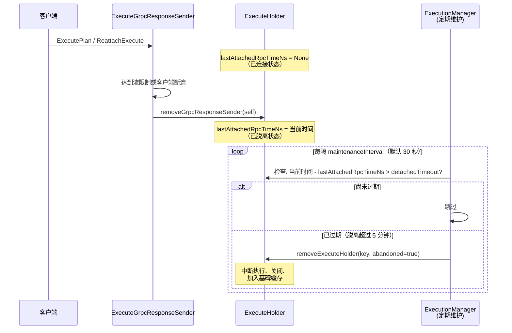

**为什么重要：**
- 设置太短 — 网络较慢的客户端可能来不及重连，导致结果丢失。
- 设置太长 — 被遗弃的执行会占用内存（缓冲的响应）以及可能未取消的 Spark 作业。
- 重连时，如果墓碑存在，客户端收到 `OPERATION_ABANDONED`；如果墓碑已从缓存中过期，
  客户端收到 `OPERATION_NOT_FOUND`。

---

### 7.2 `spark.connect.execute.reattachable.senderMaxStreamSize`

| 属性 | 值 |
|------|-----|
| **配置键** | `spark.connect.execute.reattachable.senderMaxStreamSize` |
| **默认值** | `1g`（1 GiB） |
| **单位** | 字节（支持大小字符串如 `1g`、`1073741824`） |
| **设为 0** | 不限制 |

**控制内容：** 在单个 gRPC 流上发送的响应总字节数上限。超过后服务端会关闭该流，
客户端必须调用 `ReattachExecute` 继续接收。

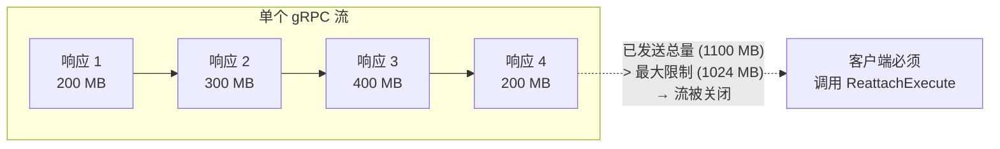

**代码逻辑**（`ExecuteGrpcResponseSender.execute`）：

```
maximumResponseSize = conf.get(SENDER_MAX_STREAM_SIZE)  // 例如 1 GiB
sentResponsesSize   = 0

while (!finished) {
    response = observer.consumeResponse(nextIndex)
    sendResponse(response)
    sentResponsesSize += response.serializedByteSize

    if (sentResponsesSize > maximumResponseSize) {
        // deadlineLimitReached → true
        grpcObserver.onCompleted()  // 优雅关闭流
        // 客户端必须调用 ReattachExecute 获取剩余响应
    }
}
```

触发阈值的那个响应**仍然会被发送** — 限制是在发送之后检查的。这保证了每个响应至少
会被投递一次。

**为什么重要：**
- 防止单个长时间运行的查询在一个 HTTP/2 流上积压数 GB 的缓冲数据。
- 给客户端提供定期的检查点，客户端可以通过 `ReleaseExecute(releaseUntil)` 确认接收。
- 在流之间的间隙，服务端可以释放已确认的响应。

---

### 7.3 `spark.connect.execute.reattachable.senderMaxStreamDuration`

| 属性 | 值 |
|------|-----|
| **配置键** | `spark.connect.execute.reattachable.senderMaxStreamDuration` |
| **默认值** | `2m`（2 分钟） |
| **单位** | 毫秒（支持时间字符串如 `2m`、`120000`） |
| **设为 0** | 不限制 |

**控制内容：** 单个 gRPC 流允许运行的最大挂钟时间。超过后服务端会关闭该流。

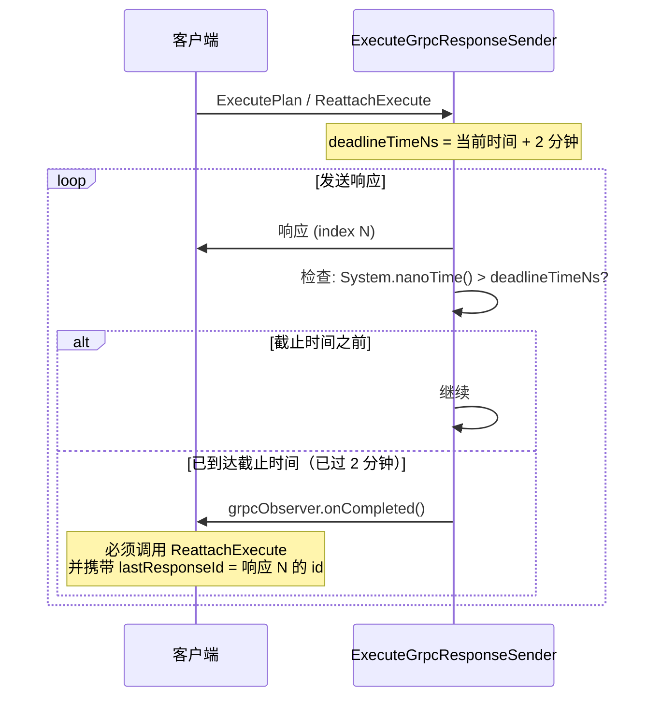

**`updateDeadlineTimeNs` 的工作逻辑：**

```
if (reattachable && confDuration > 0) {
    deadlineTimeNs = startTime + confDuration * NANOS_PER_MILLIS
} else {
    deadlineTimeNs = startTime + 180天   // 实际上等于无限制
}
```

截止时间在每次 `execute()` 调用开始时设置一次（即每个 gRPC 流一次，而非每次执行一次）。
每次 `ReattachExecute` 都会创建新的发送器，拥有全新的截止时间。

**为什么重要：**
- 防范过期的 HTTP/2 连接和负载均衡器空闲超时。
- 确保客户端定期向服务端"签到" — 这是服务端判断客户端是否仍然存活的信号。
- 与 `senderMaxStreamSize` 配合，同时提供基于时间和基于大小的流轮换机制。

---

### 7.4 三个配置如何协同工作

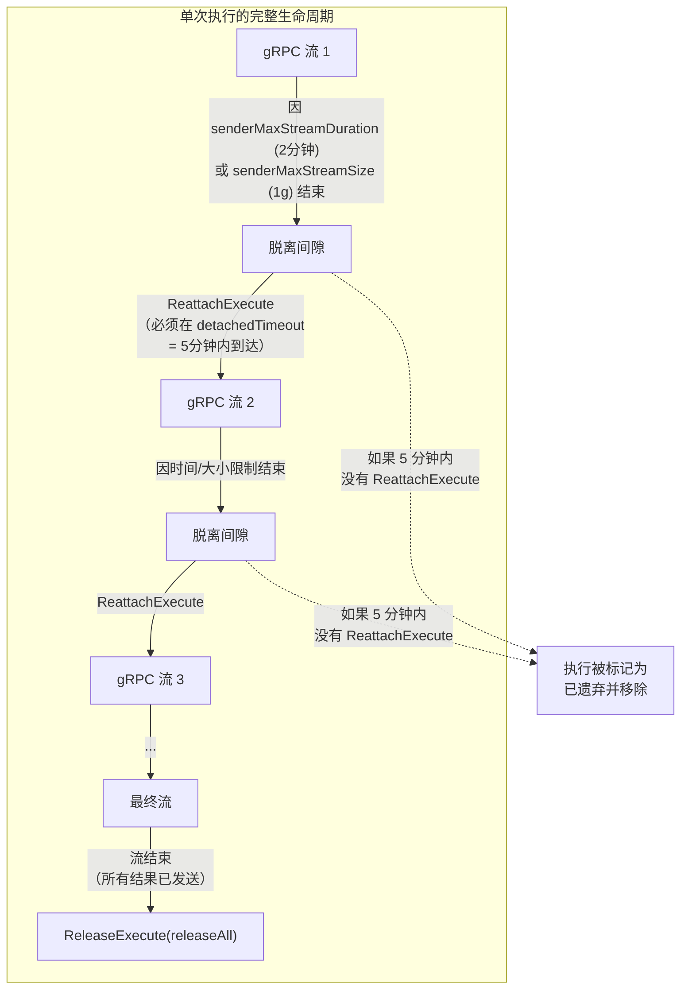

一个典型的大查询生命周期：

1. 客户端调用 **ExecutePlan**。服务端创建执行、启动它，并开始流式发送响应。
2. 经过 2 分钟（`senderMaxStreamDuration`）**或**响应总量达到 1 GiB
   （`senderMaxStreamSize`），以先到达者为准，服务端关闭该 gRPC 流。
3. 执行进入**已脱离**状态。后台执行线程继续运行，将响应写入缓冲区。
4. 客户端调用 **ReattachExecute**，携带它收到的最后一个 `lastResponseId`。
   新的发送器从上一个发送器停止的位置继续。
5. 在重连调用之间，客户端可以发送 **ReleaseExecute(releaseUntil)** 来释放
   服务端缓冲区中已经处理过的响应所占用的内存。
6. 重复步骤 2-5，直到所有响应都发送完毕。
7. 客户端发送 **ReleaseExecute(releaseAll)** 进行清理。
8. 如果在任何时刻客户端未能在 `detachedTimeout`（默认 5 分钟）内重连，
   服务端的定期维护线程会将该执行标记为已遗弃并移除。

---

## 8. ExecuteResponseObserver 中的响应缓冲

`ExecuteResponseObserver` 是解耦执行线程和 gRPC 发送器线程的核心缓冲区。

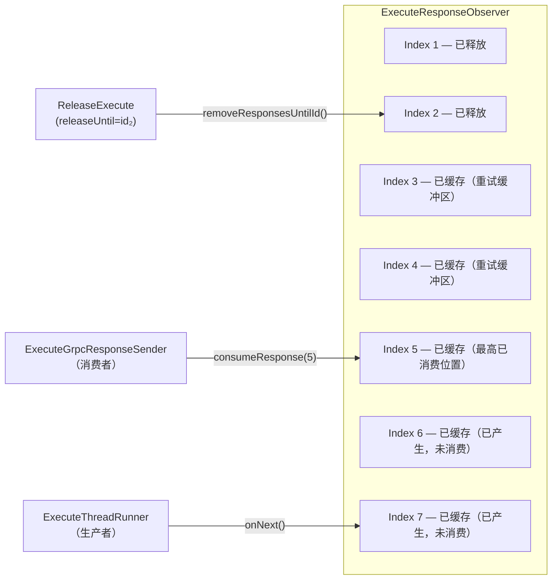

### 缓冲区管理规则

| 机制 | 触发条件 | 效果 |
|------|---------|------|
| **自动移除** | 调用 `consumeResponse(N)` | 索引 `N` 之前的响应会被淘汰，但保留最近 `retryBufferSize`（默认 10 MiB）大小的响应用于重试 |
| **显式释放** | `ReleaseExecute(releaseUntil=responseId)` | `responseId` 及之前的所有响应被移除 |
| **全部释放** | `ReleaseExecute(releaseAll)` 或执行关闭 | 所有缓存的响应被释放 |

**重试缓冲区**（`observerRetryBufferSize`，默认 10 MiB）的存在是为了：如果
`ReattachExecute` 请求最近刚发送过的响应，可以从缓冲区中重放，而不需要失败。
如果请求的响应已经被淘汰，服务端会返回 `POSITION_NOT_AVAILABLE` 错误。

---

## 9. 可重连 vs 非可重连 对比总结

| 方面 | 可重连（Reattachable） | 非可重连（Non-Reattachable） |
|------|----------------------|---------------------------|
| **启用条件** | `CONNECT_EXECUTE_REATTACHABLE_ENABLED=true` 且请求中 `reattachable=true` | 其他情况 |
| **发送器线程** | 后台线程（允许 gRPC `OnReadyHandler` 回调） | gRPC 处理线程 |
| **背压控制** | `isReady()` + `OnReadyHandler` | 无 |
| **流大小限制** | `senderMaxStreamSize`（默认 1g） | `Long.MaxValue`（无限制） |
| **流时间限制** | `senderMaxStreamDuration`（默认 2m） | 180 天（实际上无限制） |
| **清理方式** | 客户端必须调用 `ReleaseExecute(releaseAll)` | 发送器结束时自动移除 |
| **重试缓冲区** | `observerRetryBufferSize`（默认 10m） | 0（不缓冲） |
| **脱离超时** | `detachedTimeout`（默认 5m） | 不适用（不会脱离） |

---

## 10. 错误处理速查表

| 错误类型 | 触发场景 |
|---------|---------|
| `INVALID_HANDLE.OPERATION_ALREADY_EXISTS` | `ExecutePlan` 使用的 `operationId` 已有一个运行中的执行，且执行计划不同 |
| `INVALID_HANDLE.OPERATION_ABANDONED` | 执行因脱离超时被移除，且墓碑记录存在 |
| `INVALID_HANDLE.OPERATION_NOT_FOUND` | `ReattachExecute` 请求的执行不存在，且没有墓碑记录 |
| `INVALID_CURSOR.NOT_REATTACHABLE` | 对非可重连执行调用 `ReattachExecute` 或 `ReleaseExecute` |
| `INVALID_CURSOR.POSITION_NOT_AVAILABLE` | `ReattachExecute` 携带的 `lastResponseId` 对应的响应已从重试缓冲区中被淘汰 |
| `INVALID_CURSOR.POSITION_NOT_FOUND` | `ReattachExecute` 携带的 `lastResponseId` 在流中不存在 |
| `INVALID_CURSOR.DISCONNECTED` | 发送器被中断（例如被新的 `ReattachExecute` 替换） |

---

*本文基于 Apache Spark 4.2.0 源代码分析。*
