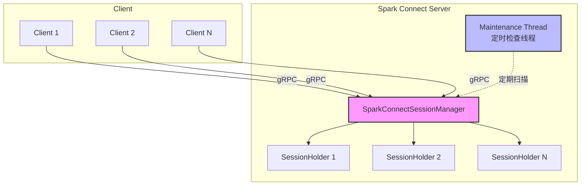
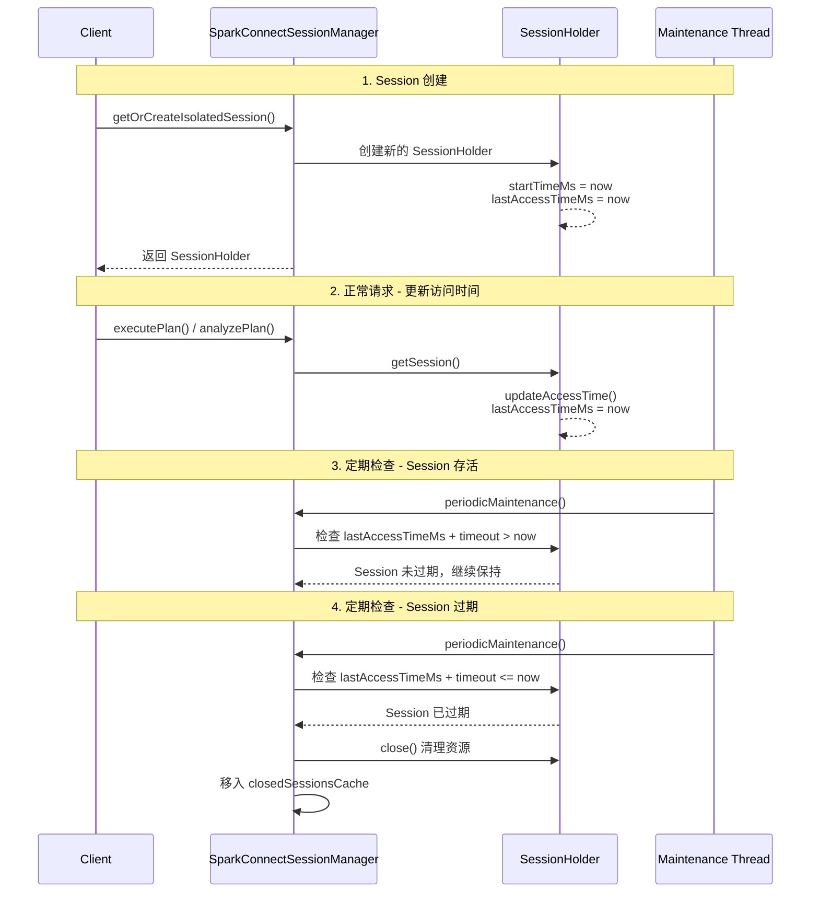
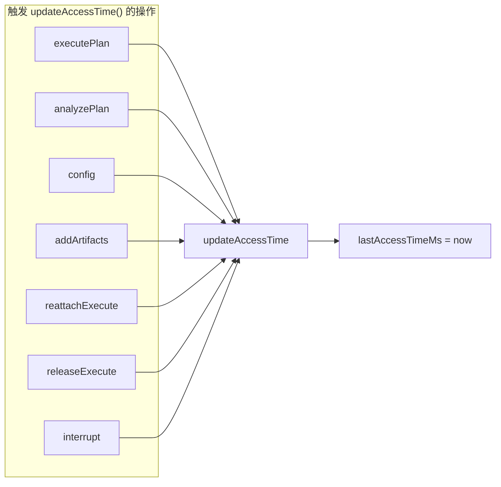
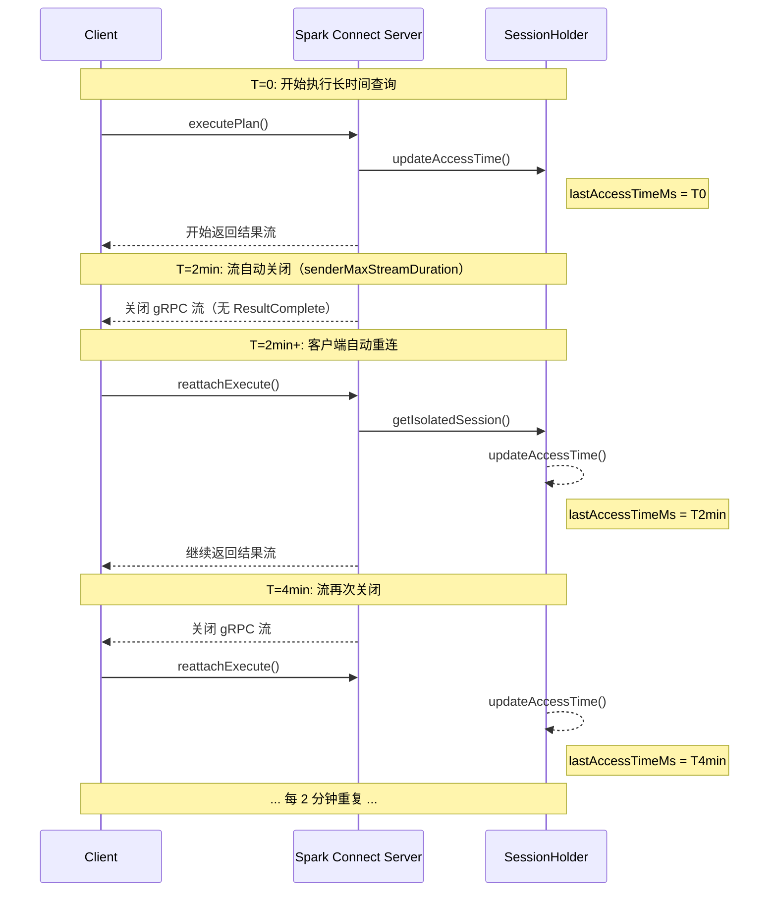
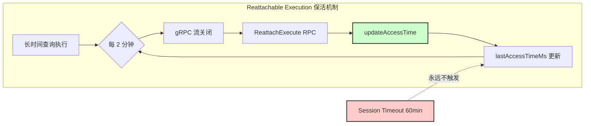
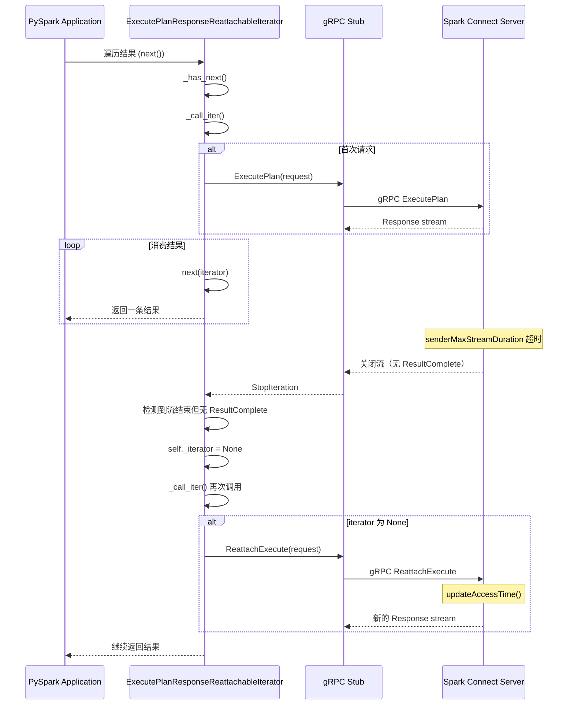
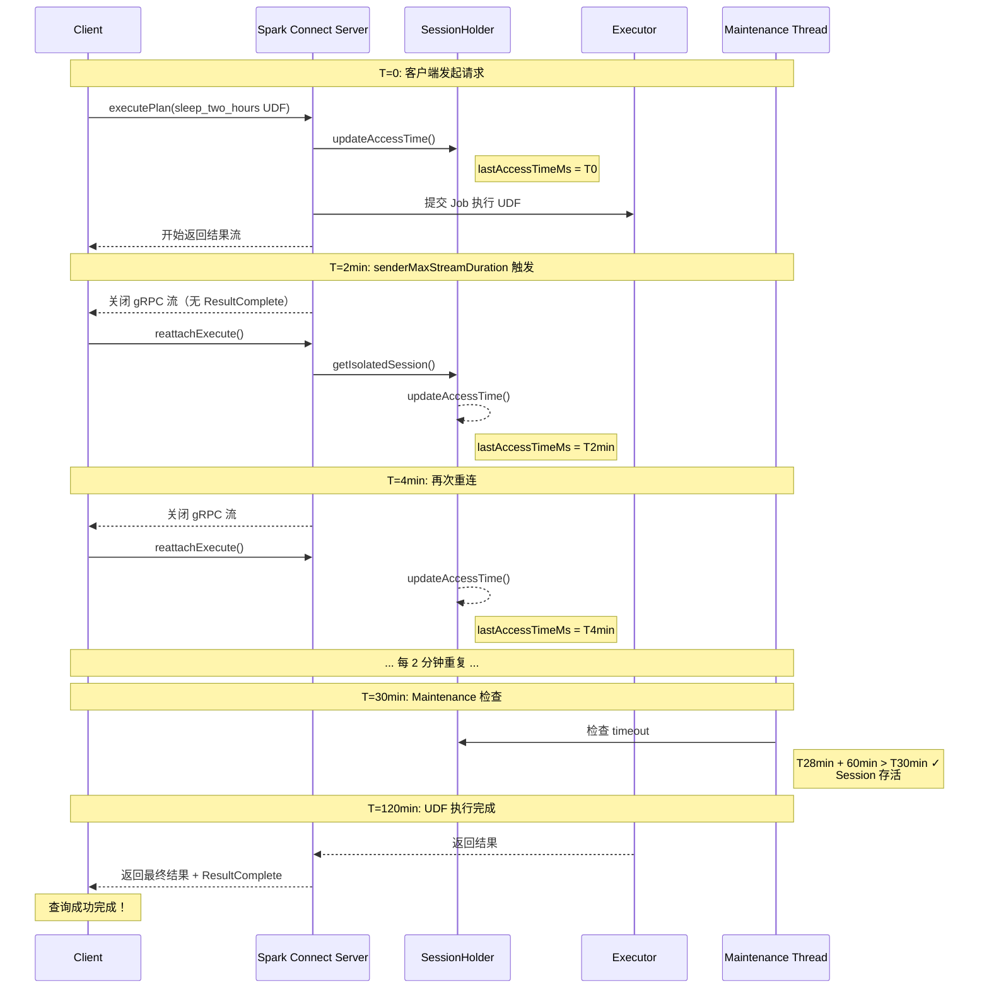
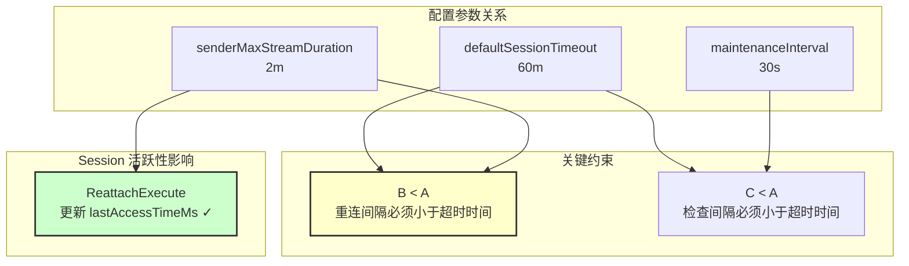
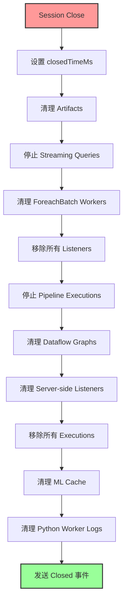

# Spark Connect Session Timeout 机制详解

本文基于 Spark 4.1 学习 Spark Connect 的 Session Timeout 机制。Coauthored with `claude-4.5-opus-high`.

## 目录
{: .no_toc .text-delta}

1. TOC
{:toc}

## 概述

Spark Connect 采用 Client-Server 架构，Client 通过 gRPC 与 Server 端通信。为了有效管理服务器资源，Spark Connect 引入了 Session Timeout 机制，用于清理长时间不活跃的 Session，释放相关资源。

理解 Session Timeout 机制对于正确使用 Spark Connect 非常重要，特别是在处理长时间运行的任务时。

## Session Timeout 核心概念

### 关键组件



Spark Connect Session Timeout 涉及以下几个核心组件：

| 组件 | 描述 |
|------|------|
| `SparkConnectSessionManager` | 全局 Session 管理器，负责创建、管理和清理所有 SessionHolder |
| `SessionHolder` | 持有单个 Session 的状态，包括 SparkSession、最后访问时间等 |
| `Maintenance Thread` | 定时执行的维护线程，负责检查并清理过期的 Session |

### 关键时间戳

每个 `SessionHolder` 维护以下关键时间属性：

- **`startTimeMs`**: Session 创建时间
- **`lastAccessTimeMs`**: 最后一次访问时间（每次 RPC 请求时更新）
- **`customInactiveTimeoutMs`**: 自定义超时时间（可选）
- **`closedTimeMs`**: Session 关闭时间

## 相关配置参数

### Session 管理配置

| 配置参数 | 默认值 | 描述 |
|----------|--------|------|
| `spark.connect.session.manager.defaultSessionTimeout` | 60m | Session 默认超时时间，设置为 -1 表示永不超时 |
| `spark.connect.session.manager.maintenanceInterval` | 30s | 维护线程的检查间隔 |
| `spark.connect.session.manager.closedSessionsTombstonesSize` | 1000 | 已关闭 Session 缓存的最大数量 |

### 执行相关配置（与 Session 活跃性密切相关）

| 配置参数 | 默认值 | 描述 |
|----------|--------|------|
| `spark.connect.execute.reattachable.enabled` | true | 是否启用可重连执行，启用后客户端会定期重新连接 |
| `spark.connect.execute.reattachable.senderMaxStreamDuration` | 2m | 单个 gRPC 流的最大持续时间，超时后客户端需重新连接 |

## Session Timeout 工作流程

### 整体流程



### 超时判断逻辑

Session 是否超时的判断逻辑如下：

```scala
def shouldExpire(info: SessionHolderInfo, nowMs: Long): Boolean = {
  val timeoutMs = if (info.customInactiveTimeoutMs.isDefined) {
    info.customInactiveTimeoutMs.get
  } else {
    defaultInactiveTimeoutMs  // 默认 60 分钟
  }
  // timeout 为 -1 表示永不超时
  timeoutMs != -1 && info.lastAccessTimeMs + timeoutMs <= nowMs
}
```

### 访问时间更新时机

`lastAccessTimeMs` 在以下情况下会被更新：

1. **Session 创建时**: 初始化为当前时间
2. **每次 RPC 请求时**: 当 `getSession()` 被调用时自动更新



## Reattachable Execution 与 Session 保活

### Reattachable Execution 机制

从 Spark 3.5 开始，Spark Connect 默认启用了 **Reattachable Execution**（可重连执行）机制。这个机制对于理解 Session Timeout 至关重要。



**关键发现**: 当 Reattachable Execution 启用时（默认配置），客户端每隔 `senderMaxStreamDuration`（默认 2 分钟）就会发送 `ReattachExecute` RPC 请求，而每次 `ReattachExecute` 都会调用 `getIsolatedSession()`，从而更新 `lastAccessTimeMs`！

### 这意味着什么？

在默认配置下（Reattachable Execution 启用），即使是长达数小时的查询，Session 也**不会因为超时被关闭**，因为：

1. 每 2 分钟，gRPC 流会自动关闭
2. 客户端自动发送 `ReattachExecute` 请求重新连接
3. 每次 `ReattachExecute` 都会更新 Session 的 `lastAccessTimeMs`
4. 60 分钟的默认超时永远不会触发



### PySpark 客户端如何触发 ReattachExecute

PySpark 客户端通过 `ExecutePlanResponseReattachableIterator` 类（位于 `pyspark/sql/connect/client/reattach.py`）自动处理重连逻辑。

#### 核心流程



#### 关键代码解析

**1. 检测流结束并触发重连**

当 gRPC 流结束但没有收到 `ResultComplete` 消息时，客户端知道还有更多数据，需要重连：

```python
# pyspark/sql/connect/client/reattach.py - _has_next() 方法
# Graceful reattach:
# If iterator ended, but there was no ResponseComplete, it means that
# there is more, and we need to reattach.
if not self._result_complete and not has_next:
    while not has_next:
        # unset iterator for new ReattachExecute to be called in _call_iter
        self._iterator = None
        self._current = self._call_iter(lambda: next(self._iterator))
        has_next = self._current is not None
```

**2. 发送 ReattachExecute 请求**

当 `_iterator` 为 `None` 时，`_call_iter` 方法会自动调用 `ReattachExecute`：

```python
# pyspark/sql/connect/client/reattach.py - _call_iter() 方法
def _call_iter(self, iter_fun: Callable) -> Any:
    if self._iterator is None:
        # we get a new iterator with ReattachExecute if it was unset.
        self._iterator = iter(
            self._stub.ReattachExecute(
                self._create_reattach_execute_request(), metadata=self._metadata
            )
        )
    # ...
```

**3. 构建 ReattachExecute 请求**

请求包含 `session_id`、`operation_id` 和上次处理的 `response_id`：

```python
# pyspark/sql/connect/client/reattach.py - _create_reattach_execute_request() 方法
def _create_reattach_execute_request(self) -> pb2.ReattachExecuteRequest:
    reattach = pb2.ReattachExecuteRequest(
        session_id=self._initial_request.session_id,
        user_context=self._initial_request.user_context,
        operation_id=self._initial_request.operation_id,
    )
    if self._last_returned_response_id:
        reattach.last_response_id = self._last_returned_response_id
    return reattach
```

#### 为什么这能保持 Session 活跃？

在服务端，`ReattachExecute` 请求由 `SparkConnectReattachExecuteHandler` 处理：

```scala
// SparkConnectReattachExecuteHandler.scala
def handle(v: proto.ReattachExecuteRequest): Unit = {
  val sessionHolder = SparkConnectService.sessionManager
    .getIsolatedSession(  // 这里会触发 updateAccessTime()
      SessionKey(v.getUserContext.getUserId, v.getSessionId),
      previousSessionId)
  // ...
}
```

`getIsolatedSession` 内部调用 `getSession`，其中会更新访问时间：

```scala
// SparkConnectSessionManager.scala
private def getSession(...): SessionHolder = {
  // ...
  if (session != null) {
    session.updateAccessTime()  // 关键：更新 lastAccessTimeMs
  }
  session
}
```

### 何时仍可能出现 Session Timeout？

即使有 Reattachable Execution 保护，以下场景仍可能触发 Session Timeout：

1. **网络问题导致重连失败**: 客户端无法成功发送 `ReattachExecute` 请求
2. **客户端进程异常**: 客户端进程崩溃或被终止，无法发送重连请求
3. **查询之间的空闲期过长**: 一个查询完成后，超过 60 分钟没有新的请求

## 长时间运行任务示例分析

### 示例场景

考虑以下使用 UDF 的场景，UDF 执行需要 2 小时：

```python
from pyspark.sql.functions import udf
from pyspark.sql.types import StringType
import time

@udf(returnType=StringType())
def sleep_two_hours(x):
    time.sleep(7200)  # 2 小时
    return f"Slept for 2 hours, input was: {x}"

# 注册 UDF
spark.udf.register("sleep_two_hours", sleep_two_hours)

# 创建 DataFrame 并应用 UDF
df = spark.createDataFrame([(1,)], ["id"])
result = df.select(sleep_two_hours("id").alias("result"))
result.show()  # 这个操作会执行 2 小时
```

### 实际执行流程（Reattachable 启用）

由于 Reattachable Execution 默认启用，2 小时的 UDF 执行过程如下：



**结论**: 在默认配置下，即使 UDF 执行 2 小时，Session 也不会超时，因为：
- 每 2 分钟客户端自动发送 `ReattachExecute`
- 每次 `ReattachExecute` 都会更新 `lastAccessTimeMs`
- Session Timeout 检查时，`lastAccessTimeMs` 始终在 2 分钟内

### 关键代码分析

从 `SparkConnectReattachExecuteHandler` 可以看到，`ReattachExecute` 会调用 `getIsolatedSession`：

```scala
// SparkConnectReattachExecuteHandler.scala
def handle(v: proto.ReattachExecuteRequest): Unit = {
  val sessionHolder = SparkConnectService.sessionManager
    .getIsolatedSession(  // 这里会触发 updateAccessTime()
      SessionKey(v.getUserContext.getUserId, v.getSessionId),
      previousSessionId)
  // ...
}
```

而 `getIsolatedSession` 内部调用 `getSession`，其中会更新访问时间：

```scala
// SparkConnectSessionManager.scala
private def getSession(key: SessionKey, default: Option[() => SessionHolder]): SessionHolder = {
  // ...
  // Record the access time before returning the session holder.
  if (session != null) {
    session.updateAccessTime()  // 关键：更新 lastAccessTimeMs
  }
  session
}
```

## 配置关系总结



| 场景 | 推荐配置 |
|------|----------|
| 长时间查询（默认） | 保持默认，Reattachable 自动保活 |
| 网络不稳定 | 减小 `senderMaxStreamDuration` 增加重连频率 |
| 查询间空闲期长 | 增加 `defaultSessionTimeout` |
| 生产环境稳定网络 | 可适当增加 `senderMaxStreamDuration` 减少重连开销 |

## Session 关闭时的资源清理

当 Session 超时或主动关闭时，会执行以下清理操作：



## 最佳实践

1. **保持 Reattachable Execution 启用**: 这是默认配置，能自动处理大多数长时间运行场景
2. **理解配置参数关系**: 确保 `senderMaxStreamDuration < defaultSessionTimeout`
3. **评估任务执行时间**: 在部署前，评估可能的最长任务执行时间
4. **合理配置超时时间**: 根据业务需求设置合适的 `defaultSessionTimeout`
5. **监控 Session 状态**: 通过 Spark Connect UI 监控 Session 的活跃状态
6. **处理 Session 关闭错误**: 客户端代码应该优雅处理 `SESSION_CLOSED` 错误

## 总结

Spark Connect 的 Session Timeout 机制是资源管理的重要组成部分。关键要点：

1. **默认配置下长时间查询是安全的**: 由于 Reattachable Execution 默认启用，客户端每 2 分钟（`senderMaxStreamDuration`）会自动发送 `ReattachExecute` RPC，更新 Session 访问时间，因此 60 分钟的超时不会影响正在执行的查询。

2. **`ReattachExecute` 是保活的关键**: 每次 `ReattachExecute` RPC 请求都会更新 `lastAccessTimeMs`，这是长时间运行查询保持 Session 活跃的核心机制。

3. **Session Timeout 问题主要发生在**:
   - 网络问题导致 `ReattachExecute` 失败时
   - 客户端进程异常终止时
   - 查询之间的空闲期过长时

4. **配置建议**:
   - 确保 `senderMaxStreamDuration < defaultSessionTimeout`
   - 网络不稳定时，减小 `senderMaxStreamDuration`
   - 查询间空闲期长时，增加 `defaultSessionTimeout`

理解 Reattachable Execution 与 Session Timeout 的交互关系，是正确使用 Spark Connect 处理长时间运行任务的关键。

